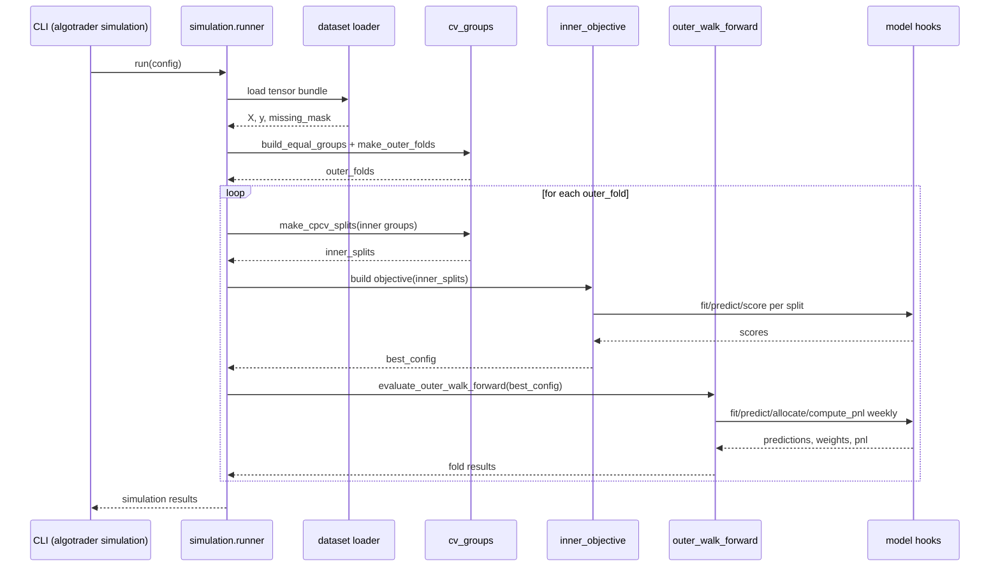

# Docs

LLM reading order:
- `AGENTS.md` - coding rules and workflow
- `docs/repo_structure.md` - architecture and module map
- `docs/configuration.md` - config and env setup
- `docs/workflows.md` - common tasks and CLI
- `docs/feature_engineering.md` - feature groups and definitions
- `docs/simulation/nestedcv.md` - nested CV details
- `docs/simulation/nestedcv_sequence.md` - nested CV sequence flow

Doc map:
- `docs/repo_structure.md` - directory layout and module responsibilities
- `docs/configuration.md` - config, env vars, and data locations
- `docs/workflows.md` - CLI commands and extension guides
- `docs/feature_engineering.md` - feature engineering reference
- `docs/simulation/nestedcv.md` - nested CV background and math
- `docs/simulation/nestedcv_sequence.md` - nested CV sequence flow

## Full Docs

### `docs/repo_structure.md`

# Repo structure

```
algo_trader/
  cli/
  application/
    data_cleaning/
    data_processing/
    feature_engineering/
    historical/
    modeling/
    simulation/
  domain/
    market_data/
    simulation/
  infrastructure/
    data/
    exporters/
  preprocessing/
  providers/
    historical/
    live/
  pipeline/
    stages/
```

- `cli/` parses command-line args and routes to use-cases; entrypoints only.
- `application/` orchestrates workflows and wires protocols to concrete providers.
- `application/data_cleaning/` builds weekly returns and OHLC from raw data.
- `application/data_processing/` runs preprocessors and writes processed feature sets.
- `application/feature_engineering/` computes feature groups from cleaned inputs.
- `application/historical/` handles historical data downloads and requests.
- `application/modeling/` runs inference workflows and model I/O.
- `application/simulation/` runs nested CV simulation and evaluation wiring.
- `domain/` holds core models and protocols; stays stable and vendor-agnostic.
- `domain/market_data/` domain models and interfaces for market data.
- `domain/simulation/` simulation interfaces and configuration types.
- `infrastructure/` shared plumbing (env, logging, storage, event bus).
- `infrastructure/data/` shared data utilities, schemas, and storage helpers.
- `infrastructure/exporters/` exporters for saving or emitting artifacts.
- `preprocessing/` feature preprocessing implementations (z-score, PCA, etc.).
- `providers/` vendor adapters like IB or Alpaca.
- `providers/historical/` historical data provider adapters.
- `providers/live/` live data/execution provider adapters.
- `pipeline/` composable stages (preprocess, features, model, metrics).
- `pipeline/stages/` concrete pipeline stages and registries.

## Outputs and env vars

This repo keeps detailed workflow output docs in `docs/workflows.md` and configuration
details in `docs/configuration.md`. The summary below is a quick index.

Environment variables (names only, see `.env` and `.env.example`):
- `OPENAI_API_KEY`
- `DATA_SOURCE`
- `DATA_LAKE_SOURCE`
- `FEATURE_STORE_SOURCE`
- `MODEL_STORE_SOURCE`
- `SIMULATION_SOURCE`
- `MAX_PARALLEL_REQUESTS`
- `IB_HOST`
- `IB_PORT`
- `IB_CLIENT_ID`
- `TORCH_DEVICE`
- `HISTORICAL_DATA_PROVIDER` (optional)
- `HISTORICAL_DATA_EXPORTER` (optional)
- `LOG_DEST` (optional)
- `LOG_LEVEL` (optional)
- `LOG_FILE_PATH` (required if `LOG_DEST` includes `file`)

Output locations (by pipeline stage, see `docs/workflows.md` for full detail):
- Historical download: `DATA_SOURCE/<asset>/<YYYY>/hist_data_YYYY-MM.csv`
- Data cleaning: `DATA_LAKE_SOURCE/YYYY-WW/` (returns, OHLC, metadata, return tensor)
- Data processing: `FEATURE_STORE_SOURCE/<preprocessor>/<pipeline>/<YYYY-WW>/` (processed CSV + tensors)
- Feature engineering: `FEATURE_STORE_SOURCE/YYYY-WW/<group>/` (features CSV + tensor + metadata)
- Modeling: `MODEL_STORE_SOURCE/<model>/<guide>/<pipeline>/<YYYY-WW>/` (params CSV + metadata)
- Simulation: `SIMULATION_SOURCE/<version>/` (inputs, preprocessing, inner/outer, cv)

### `docs/configuration.md`

# Configuration

**Setup**
- Copy `config/tickers.example.yml` to `config/tickers.yml` and edit `tickers`, `duration`, `bar_size`, and `what_to_show`.
- Set `MAX_PARALLEL_REQUESTS`, `IB_HOST`, `IB_PORT`, and `IB_CLIENT_ID` in `.env` (see `.env.example`).

**Data Cleaning**
- Env: `DATA_SOURCE`, `DATA_LAKE_SOURCE`.
- Output: `DATA_LAKE_SOURCE/YYYY-WW/` with `returns.csv`, `weekly_ohlc.csv`, `weekly_ohlc_meta.json`, `daily_ohlc.csv`, `daily_ohlc_meta.json`.
- Notes: `daily_ohlc_meta.json` includes per-asset missing days (Mon-Fri only), recorded at the last available hour across all assets for that day, plus monthly missing counts.

**Data Processing**
- Env: `DATA_LAKE_SOURCE`, `FEATURE_STORE_SOURCE`.
- Output: `FEATURE_STORE_SOURCE` under `.env`.
- Behavior: selects the latest `YYYY-WW`, reads `returns.csv`, writes `processed.csv` to the feature store.

**Modeling/Inference**
- Env: `FEATURE_STORE_SOURCE` (input), `MODEL_STORE_SOURCE` (outputs).
- Output: `MODEL_STORE_SOURCE` under `.env`.
- Behavior: reads the latest prepared data from the feature store (or `--input`), writes parameter outputs to the model store.

**Simulation**
- Config: edit `config/simulation.yml` or pass `--simulation-config`.
- Loader: fixed to `feature_store_panel` (not configurable).
- Inputs: always build combined `T x A x F` tensor from the latest feature store groups plus the latest data lake return tensor.
- Output path: `data.simulation_output_path` chooses the label under `SIMULATION_SOURCE` (e.g., `run_a`); null defaults to the latest `YYYY-WW`.
- Reuse rule: if the output directory already exists, reuse `inputs/panel_tensor.pt`; if it exists without that file, raise an error.
- Flags: `simulation_mode` and `stop_after` control dry-run vs stub/full execution and early stopping.
- Outputs: `SIMULATION_SOURCE/<label>/` with inputs, preprocessing, inner/outer artifacts, and `cv/` outputs like `cv_structure.json`, `summary.json`, and `timestamps_cv.csv`.
- Optional prebuild: `model.prebuild` lets you run a train-only, no-leakage initialization step before tuning. It uses the intersection of all outer-fold training indices. Outputs are written to `SIMULATION_SOURCE/<label>/artifacts/prebuild/prebuild.json`.

**Simulation Preprocessing**
- `preprocessing.min_usable_ratio`: drop features with usable ratio below this threshold.
- `preprocessing.min_variance`: drop features with variance below this threshold.
- `preprocessing.max_abs_corr`: drop duplicate features with |corr| above this threshold.
- `preprocessing.corr_subsample`: optional subsample size for correlation pruning.
- `preprocessing.mad_eps`: MAD epsilon to avoid division by zero.
- `preprocessing.breakout_var_floor`: variance floor for breakout centering.
- `preprocessing.winsor_low_q` / `preprocessing.winsor_high_q`: winsorization quantiles (pooled across assets per feature).
- `preprocessing.scale_floor`: minimum robust scale floor.
- `preprocessing.guard_abs_eps`: absolute near-constant threshold.
- `preprocessing.guard_rel_eps`: relative near-constant threshold.
- `preprocessing.guard_rel_offset`: relative guard offset.
- `preprocessing.clip_min` / `preprocessing.clip_max`: post-transform clipping bounds.
- `preprocessing.max_abs_fail`: fail-fast threshold for max abs scaled value (train only).
- `preprocessing.impute_missing_to_zero`: impute missing after scaling if true.
- `preprocessing.append_mask_as_features`: append missing mask as extra feature channels if true.

**Simulation Prebuild**
Use `model.prebuild` to compute data-driven defaults before the tuning phase. The prebuild hook only sees the train-only slice that is safe across all outer folds.

Config fields:
- `model.prebuild.enabled`: boolean toggle.
- `model.prebuild.name`: registered prebuild hook name.
- `model.prebuild.params`: optional hook-specific config.

Example:
```yaml
model:
  model_name: factor_model_v1
  guide_name: factor_guide_v1
  params: {}
  guide_params: {}
  prebuild:
    enabled: true
    name: factor_prior_init
    params: {}
```
- Manifest: `run_manifest.json` is always written at the base output dir.

**Simulation Dataset Params**
- `feature_store`: override `FEATURE_STORE_SOURCE` with a specific path.
- `data_lake`: override `DATA_LAKE_SOURCE` with a specific path.
- `groups`: list of feature groups to include (or `"all"` for every group).
- `target_shift`: integer shift applied when aligning targets (default = 1).
- `target_scale`: integer scale factor applied to targets (default = 1_000_000).
- `prefix_feature_names`: whether to prefix feature names with the group (default = true).

**Simulation Dataset Params Example**
```yaml
data:
  simulation_output_path: run_a
  dataset_params:
    groups: ["momentum", "volatility"]
    target_shift: 1
    target_scale: 1000000
```

## Simulation Flags

Use `simulation_mode` to control what work happens inside each phase and
`stop_after` to control how far the run proceeds. If `stop_after` is set, it
takes precedence over `simulation_mode`.

`simulation_mode` options:
- `dry_run`: build inputs and CV structure only; no inner/outer evaluation.
- `stub`: run the full pipeline but use stubbed hooks (no real fit/predict/score).
- `full`: run the full pipeline with real hooks (Pyro fit/predict/score).

`stop_after` options:
- `inputs`: stop after writing inputs.
- `cv`: stop after writing CV structure.
- `inner`: stop after the inner loop (best configs + inner artifacts).
- `outer`: stop after outer evaluation.
- `results`: stop after all outputs are written.
- `null`: run to completion.

Examples:
- Inputs only: `simulation_mode: dry_run`, `stop_after: inputs`
- CV structure only: `simulation_mode: dry_run`, `stop_after: cv`
- Full flow with stubbed hooks, stop after inner: `simulation_mode: stub`, `stop_after: inner`

### `docs/workflows.md`

# Workflows

## Basic commands using uv

- Run the CLI: `uv run algotrader [command]`.
- Install deps: `uv sync --all-groups` (installs runtime + dev deps like pytest).
- Run tests: `uv run pytest`.
- Add runtime deps: `uv add <package>`.
- Add dev deps (lint/type/etc.): `uv add <package> --group dev`.

## CLI
- Wizard (interactive command builder): `uv run algotrader wizard`
- Default pipeline (placeholder): `uv run algotrader`
- Historical download: `uv run algotrader historical`
- Data cleaning: `uv run algotrader data_cleaning --start YYYY-MM --end YYYY-MM --return-type simple --assets EUR.USD,IBUS30`
- Data processing: `uv run algotrader data_processing` (defaults to `identity`; add `--preprocessor <name>` to override)
- Feature engineering: `uv run algotrader feature_engineering`
- Simulation (nested CV): `uv run algotrader simulation --simulation-config config/simulation.yml`
- Backtest (placeholder): `uv run algotrader backtest`

## Nested CV simulation

The `simulation` command runs a **nested time-series CV**:

- **Outer loop:** walk-forward (train on past, test on future group)
- **Inner loop:** CPCV over past groups with purge + embargo for leakage control

Details and flow diagrams:
- `docs/simulation/nestedcv.md`
- `docs/simulation/nestedcv_sequence.md`
- Tuning uses `tuning.space` in `config/simulation.yml`.
- `tuning.num_samples` must be divisible by the number of categorical combos
  and yield a power-of-two count per combo.
- Candidate configs are generated for each run and written to
  `cv/candidates.json` (mapping of `candidate_id -> params`) after CV
  structure is built.
  When `model_selection.enable: true`, final selection artifacts are written
  to `outer/`.
- Optional prebuild step: `model.prebuild` runs once before tuning to compute
  data-driven defaults for `model.params` and `model.guide_params`.
  Outputs are written to `artifacts/prebuild/prebuild.json` under the simulation
  output directory.

## Data cleaning

Data cleaning return options:
- `--return-type simple` (default): `(P_t / P_{t-1}) - 1`
- `--return-type log`: `log(P_t) - log(P_{t-1})`
- `--start` is required; `--end` is optional (defaults to the latest available data).
- Data cleaning runs per-asset loading in parallel using `max(1, os.cpu_count() - 1)` workers, capped by asset count.
- Return frequency is weekly: weekly returns from hourly closes grouped by week starting Monday; uses the first available price in the week (prefers Monday) and last available price (prefers Friday), labeled with the latest timestamp in that week across assets

## Feature engineering

See `docs/feature_engineering.md` for feature groups and definitions.

## Preprocessors

**Identity** (no-op, optional copy):

```bash
uv run algotrader data_processing --preprocessor identity
uv run algotrader data_processing --preprocessor identity --preprocessor-arg copy=true
```

Args and defaults:
- `copy`: `true` or `false` (optional, default = `false`)

**Z-score** (per-column normalization over a date range, defaults missing=zero):

```bash
uv run algotrader data_processing --preprocessor zscore \
  --preprocessor-arg start_date=YYYY-MM-DD \
  --preprocessor-arg end_date=YYYY-MM-DD \
  --preprocessor-arg missing=drop \
  --preprocessor-arg pipeline=my_pipeline
```

Args and defaults:
- `start_date`: `YYYY-MM-DD` (optional, default = full range)
- `end_date`: `YYYY-MM-DD` (optional, default = full range)
- `missing`: `zero` or `drop` (optional, default = `zero`)
- `pipeline`: `A-Za-z0-9._-` (optional, default = `debug`)

Outputs:
- `processed.csv` (main output)
- `processed_tensor.pt` (values + timestamps + missing_mask)
- `mean_ref.pt`, `std_ref.pt`
- `metadata.json`

**PCA** (z-score + PCA factors; choose k or variance, not both):

```bash
uv run algotrader data_processing --preprocessor pca \
  --preprocessor-arg k=5 \
  --preprocessor-arg missing=zero \
  --preprocessor-arg pipeline=my_pipeline
```

```bash
uv run algotrader data_processing --preprocessor pca \
  --preprocessor-arg variance=0.9 \
  --preprocessor-arg missing=drop
```

Args and defaults:
- `k`: positive integer (required if `variance` is not set)
- `variance`: float in `(0, 1]` (required if `k` is not set)
- `start_date`: `YYYY-MM-DD` (optional, default = full range)
- `end_date`: `YYYY-MM-DD` (optional, default = full range)
- `missing`: `zero` or `drop` (optional, default = `zero`)
- `pipeline`: `A-Za-z0-9._-` (optional, default = `debug`)

Outputs:
- `factors.csv` (main output)
- `factors.pt`
- `loadings.csv`, `loadings.pt`
- `eigenvalues.csv`
- `metadata.json`

## Adding a new preprocessor

1) Implement `Preprocessor` in `algo_trader/preprocessing` and return a pandas `DataFrame`
   with a UTC datetime index.
2) Register the implementation in `algo_trader/preprocessing/registry.py` by adding it to `default_registry()`.
3) Invoke it via CLI: `uv run algotrader data_processing --preprocessor <name> --preprocessor-arg key=value`.

## Adding a new model/guide (Pyro)

1) Implement a Pyro model and guide in `algo_trader/pipeline/stages/modeling/`. One file per model and one file per guide. The model must implement `PyroModel` and define `__call__(self, batch: ModelBatch) -> None`. The guide must implement `PyroGuide` and define `__call__(self, batch: ModelBatch) -> None`. `ModelBatch` includes `X`, `y`, and optional `M`. See `algo_trader/pipeline/stages/modeling/test_model.py` and `algo_trader/pipeline/stages/modeling/test_guide.py` for the current examples.
2) Register both using decorators in their files: `@register_model(\"<model_name>\")` and `@register_guide(\"<guide_name>\")`. Registration happens when the modules are imported.
3) Import the new modules inside `default_model_registry()` / `default_guide_registry()` in `algo_trader/pipeline/stages/modeling/registry.py` so the decorators execute.
4) Add it to `config/simulation.yml` by setting `model.model_name` and `model.guide_name` to your registered names. Ensure the model defines an `obs` site named `"obs"` so simulation prediction works.

## Adding a prebuild hook

1) Implement a prebuild hook that accepts `PrebuildContext` and returns `PrebuildResult`.
2) Register it with `@register_prebuild("<name>")` in your module.
3) Enable it in `config/simulation.yml` under `model.prebuild`.

Example:
```python
from algo_trader.pipeline.stages.modeling import (
    PrebuildContext,
    PrebuildResult,
    register_prebuild,
)

@register_prebuild("factor_prior_init")
def factor_prior_init(context: PrebuildContext) -> PrebuildResult:
    return PrebuildResult(
        model_params={"likelihood": {"sigma_scale": 0.08}},
        guide_params={},
        metadata={"note": "train-only init"},
    )
```

## Adding a new metric (inner loop)

1) Add a metric builder under `algo_trader/application/simulation/metrics/inner/` (one file per metric). Builders receive the scoring spec and return a callable with signature `(y_true, pred, score_spec) -> float`.
2) Register it with the unified registry using `@register_metric(\"your_metric\", scope=\"inner\")`.
3) Import the new module in `algo_trader/application/simulation/metrics/inner/__init__.py` so the decorator runs.
4) Set `scoring.spec.metric_name: your_metric` in `config/simulation.yml`.
5) Note: outer-loop metrics live under `algo_trader/application/simulation/metrics/outer/` and are wired separately (use the same import pattern in `metrics/outer/__init__.py`).

## Simulation extensions

To extend simulation, define concrete dataset loaders in `algo_trader/infrastructure/data/` (e.g., a `PanelTensorDataset` loader), then register them in `algo_trader/application/simulation/registry.py`. The CLI currently uses the fixed `feature_store_panel` loader, so selecting a different loader requires code changes in the simulation runner.

## Scripts

- Show the latest return tensor: `scripts/show_return_tensor.sh [--head N] [DATA_CLEANING_DIR]`
- Show the latest feature tensor for a group: `scripts/show_feature_tensor.sh --group GROUP [--head N]`

### `docs/feature_engineering.md`

# Feature engineering

Compute feature groups from data-cleaning outputs (weekly momentum/mean-reversion/breakout plus daily-input volatility and regime features, all output weekly), plus cross-sectional transforms.

**CLI**
```bash
uv run algotrader feature_engineering \
  --group momentum
```

**Args and defaults**
- `group`: feature group to compute (repeatable; default = all registered groups). Valid values: `momentum`, `mean_reversion`, `breakout`, `cross_sectional`, `volatility`, `seasonal`, `regime`, `all`. `all` runs non-cross-sectional groups in parallel using (logical CPUs - 1) workers, then computes `cross_sectional` last.
- `feature`: feature key within a group (repeatable; default = group default set). Momentum keys: `vol_scaled_momentum`, `ema_spread`. Mean-reversion keys: `z_price_ema`, `z_price_med`, `donch_pos`, `rsi_centered`, `rev`, `shock`, `range_pos`, `range_z`. Breakout keys: `brk_up`, `brk_dn`. Cross-sectional keys: `cs_rank`. Volatility keys: `vol_cc_d`, `atrp_d`, `vol_regime_cc`, `vov_norm`, `vol_ts_cc_1w_4w`, `vol_ts_cc_4w_26w`, `down_up_vol_ratio_4w`, `realized_skew_d_12w`, `tail_5p_sigma_ratio_12w`, `jump_freq_4w`. Seasonal keys: `dow_alpha`, `dow_spread`. Regime keys: `glob_vol_cc_d`, `glob_vol_regime_cc`, `glob_corr_mean`, `glob_pc1_share`, `glob_disp_ret`, `glob_disp_mom`, `glob_disp_vol`.

**Outputs (per group)**
- `FEATURE_STORE_SOURCE/YYYY-WW/<group>/features.csv` (MultiIndex columns: asset, feature)
- `FEATURE_STORE_SOURCE/YYYY-WW/<group>/features_tensor.pt` (TxAxF values, timestamps, missing_mask)
- `FEATURE_STORE_SOURCE/YYYY-WW/<group>/metadata.json`

**Notes**
- Weekly inputs are loaded from `DATA_LAKE_SOURCE/YYYY-WW/weekly_ohlc.csv`.
- Volatility features use daily inputs from `DATA_LAKE_SOURCE/YYYY-WW/daily_ohlc.csv` and are sampled to weekly output.
- Seasonal features use daily inputs from `DATA_LAKE_SOURCE/YYYY-WW/daily_ohlc.csv` and are sampled to weekly output.
- Cross-sectional features use weekly inputs because they derive from momentum and mean-reversion base features.
- Regime features use daily inputs for volatility, correlation, and one-factor-ness plus weekly inputs for return/momentum dispersion; outputs are broadcast to each asset.
- Missing weekly OHLC values for any asset will raise an error.
- Metadata includes `feature_name_units` and `days_to_weeks` for horizon mapping.

**Breakout group features**
Computed on weekly OHLC data per asset (horizons shown in weeks).

Outputs:
- `brk_up_4w`, `brk_up_26w`: 1 if close_t > max(High_{t-h..t-1}), else 0.
- `brk_dn_4w`, `brk_dn_26w`: 1 if close_t < min(Low_{t-h..t-1}), else 0.

**Cross-sectional group features**
Computed on weekly output by applying cross-sectional transforms to a fixed base feature set. For each week t, U_t is the assets with valid base features and N_eff(t) is the count.

`cs_rank_*` is the cross-sectional percentile rank at week t using average rank for ties: (rank - 0.5) / N_eff(t).

Outputs:
- `cs_rank_z_mom_4w`, `cs_rank_z_mom_12w`
- `cs_rank_z_price_ema_26w`
- `cs_rank_z_price_med_26w`
- `cs_rank_rev_1w`
- `cs_rank_shock_4w`

Base features:
- Trend: `z_mom_4w`, `z_mom_12w`
- Mean-reversion: `z_price_ema_26w`, `z_price_med_26w`, `rev_1w`, `shock_4w`

**Mean-reversion group features**
Computed on weekly OHLC data per asset (horizons shown in weeks).

Outputs:
- `z_price_ema_12w`, `z_price_ema_26w`: (p_t - EMA_h(p)) / (EWM_std_h(p) + eps), where p_t = log(C_t^w) and both EWM mean/std use halflife = h.
- `z_price_med_26w`: (p_t - median(p_{t-25..t})) / (1.4826 * MAD_{26}(p) + eps), with MAD computed on log closes in the 26w window.
- `donch_pos_4w`: (C_t^w - low_4w(t)) / (high_4w(t) - low_4w(t) + eps), where high_4w/low_4w are rolling 4-week High/Low extrema.
- `rsi_centered_4w`: RSI_4w(C^w) - 50, computed on weekly closes.
- `rev_1w`: -log(C_{t-1}^w / C_{t-2}^w), i.e., negative 1-week log return lagged one week.
- `shock_4w`: r_{t-1}^w / (std(r_{t-4..t-1}^w) + eps), where r^w is weekly log returns.
- `range_pos_1w`: (C_t^w - mid_t) / (0.5 * range_t + eps), mid_t = (H_t^w + L_t^w)/2, range_t = H_t^w - L_t^w.
- `range_z_12w`: (range_t - mean(range_{t-11..t})) / (std(range_{t-11..t}) + eps), where range_t = H_t^w - L_t^w.

**Momentum group features**
Computed on weekly OHLC data per asset (horizons shown in weeks; returns are log for momentum features).

Outputs:
- `z_mom_4w`, `z_mom_12w`, `z_mom_26w`: log cumulative return divided by (sigma_ref * sqrt(H) + eps), where sigma_ref is the 26w rolling std of weekly log returns.
- `ema_spread_4w_26w`, `ema_spread_12w_26w`: (EMA_s - EMA_l) on weekly closes normalized by ATR_l on weekly bars (longer horizon).

**Regime group features**
Computed on daily inputs (volatility, correlation, one-factor-ness) and weekly inputs (dispersion), then broadcast to all assets at week t (horizons shown in weeks; defaults = 1, 4, 12, 26).

Outputs:
- `glob_vol_cc_d_4w`: mean close-to-close realized vol across assets over daily returns, sampled weekly.
- `glob_vol_regime_cc_4w_26w`: log ratio of current 4w global vol vs the prior 26w median of 4w global vol (eps=1e-6).
- `glob_corr_mean_12w`: average pairwise correlation across assets over the last 12w of daily returns.
- `glob_pc1_share_12w`: leading eigenvalue share of the 12w daily-return covariance matrix.
- `glob_disp_ret_1w`: cross-sectional dispersion of 1w log returns using MAD scaling (1.4826 * MAD).
- `glob_disp_mom_12w`: cross-sectional dispersion of 12w momentum using MAD scaling (1.4826 * MAD).
- `glob_disp_vol_4w`: cross-sectional dispersion of 4w close-to-close vol using MAD scaling (1.4826 * MAD).

**Seasonal group features**
Computed on daily OHLC data per asset, then sampled to weekly output (horizons shown in weeks; defaults = 26).
Daily returns are log returns on daily closes: r_d = log(C_d) - log(C_{d-1}).
For each weekly output t and horizon h, use the last h completed weeks (Mon-Fri) and compute the weekday means.

Outputs:
- `dow_alpha_Mon_26w`, `dow_alpha_Fri_26w`
- `dow_spread_26w`: max weekday mean - min weekday mean over the last 26 weeks

**Volatility group features**
Computed on daily OHLC data per asset, then sampled to weekly output (horizons shown in weeks; defaults = 1, 4, 12, 26).
Missing daily OHLC rows are dropped before indicator computation; data-quality ratios are written to `goodness.json` as valid / horizon for volatility and regime and missing / horizon for weekly groups. Timestamp keys in `goodness.json` use `YYYY-MM-DD_HH:MM:SS+00:00`.

Outputs:
- `vol_cc_d_4w`, `vol_cc_d_26w`: close-to-close realized vol over the stated horizon of daily returns.
- `atrp_d_4w`: ATR over the stated horizon of daily bars, divided by close.
- `vol_regime_cc_4w_26w`: current 4w vol vs median of prior 26 weeks of 4w vol history.
- `vov_norm_12w`: log((a_12w + eps) / (B + eps)), where a_12w is std(|r_t|) over last 12w daily returns and B is the median of the prior 26w of a_12w.
- `vol_ts_cc_1w_4w`: log ratio of 1w vs 4w close-to-close vol.
- `vol_ts_cc_4w_26w`: log ratio of 4w vs 26w close-to-close vol.
- `down_up_vol_ratio_4w`: log ratio of downside vs upside vol (eps=1e-6).
- `realized_skew_d_12w`: clipped realized skewness over 12 weeks.
- `tail_5p_sigma_ratio_12w`: log ratio of empirical 5% tail vs 1.645*sigma_12w (eps=1e-6).
- `jump_freq_4w`: fraction of last 4w days with |r| > 2*sigma_12w.

**Feature reference**
This section provides a quick explanation of each feature key (independent of horizon suffixes).

Breakout:
- `brk_up`: 1 if close exceeds the prior rolling high over the horizon.
- `brk_dn`: 1 if close breaks below the prior rolling low over the horizon.

Cross-sectional:
- `cs_rank`: cross-sectional percentile rank at week t using average rank for ties.

Mean-reversion:
- `z_price_ema`: z-score of log price versus EWM mean with same halflife.
- `z_price_med`: z-score of log price versus rolling median using MAD-based scale.
- `donch_pos`: position of close within rolling high/low range (0 to 1).
- `rsi_centered`: RSI centered at zero (RSI minus 50).
- `rev`: negative of the prior horizon log return (lagged one week).
- `shock`: prior 1W log return scaled by 4W rolling std of 1W returns.
- `range_pos`: close position within current bar range using mid/half-range.
- `range_z`: z-score of weekly range versus rolling mean/std.

Momentum:
- `vol_scaled_momentum`: momentum divided by rolling std of 1W returns over the horizon.
- `ema_spread`: EMA differences normalized by ATR for the longer horizon.

Regime:
- `glob_vol_cc_d`: average close-to-close realized vol across assets (daily log returns), sampled weekly.
- `glob_vol_regime_cc`: log ratio of current 4w global vol vs prior 26w median of 4w global vol (eps=1e-6).
- `glob_corr_mean`: average pairwise correlation across assets over the horizon.
- `glob_pc1_share`: leading eigenvalue share of the return covariance matrix over the horizon.
- `glob_disp_ret`: cross-sectional dispersion of 1w log returns using MAD scaling (1.4826 * MAD).
- `glob_disp_mom`: cross-sectional dispersion of 12w momentum using MAD scaling (1.4826 * MAD).
- `glob_disp_vol`: cross-sectional dispersion of 4w close-to-close vol using MAD scaling (1.4826 * MAD).

Seasonal:
- `dow_alpha`: average daily log return for a weekday over the last h weeks.
- `dow_spread`: max weekday mean minus min weekday mean over the last h weeks.

Volatility:
Volatility Level (log returns only):
- `vol_cc_d`: close-to-close realized vol over daily log returns.
- `atrp_d`: ATR over daily bars as a percent of price.
- `vol_regime_cc`: log((sigma_4w+eps)/(median_26w+eps)) using sigma_4w from log-return vol, eps=1e-6.
- `vov_norm`: normalized volatility-of-vol using |r_t| over 12w (log returns), normalized by the median of the prior 26w of 12w vol-of-vol and reported as a log-ratio with eps.

Volatility term structure (ratios/slope):
- `vol_ts_cc_1w_4w`: log((v_1w+eps)/(v_4w+eps)) using v=max(vol, eps), eps=1e-6.
- `vol_ts_cc_4w_26w`: log((v_4w+eps)/(v_26w+eps)) using v=max(vol, eps), eps=1e-6.

Volatility asymmetry and tails:
- `down_up_vol_ratio_4w`: log((d+eps)/(u+eps)) with v=max(vol, eps), eps=1e-6.
- `realized_skew_d_12w`: clipped to [-5, 5], computed from 12w returns.
- `tail_5p_sigma_ratio_12w`: log(((-q05)+eps)/(1.645*sigma_12w+eps)), eps=1e-6.
- `jump_freq_4w`: count(|r| > 2*sigma_12w) / 20 over the last 4w.

### `docs/simulation/nestedcv.md`

# Nested CV Simulation (Current Implementation)

This document explains how the **simulation** command runs nested time-series cross‑validation in the current codebase. It mirrors the implementation under:

- `algo_trader/application/simulation/`
- `algo_trader/domain/simulation/`

The goal is to evaluate models **without leakage** using:

- **Outer loop:** strict walk‑forward evaluation
- **Inner loop:** CPCV (Combinatorial Purged Cross‑Validation) for tuning
- **Purging + embargo:** to prevent label overlap leakage

---

## 1) Data Contract and Inputs

The simulation expects a **tensor bundle** with:

- `X`: features tensor of shape `[T, A, F]`
- `y`: targets tensor of shape `[T, A]`
- `missing_mask`: boolean tensor of shape `[T, A, F]` (optional; will be inferred from NaNs if missing)

By default, the CLI builds this bundle from the latest feature store groups and
data lake return tensor, then writes it to `SIMULATION_SOURCE/<label>/inputs/`
as `panel_tensor.pt`. If that file already exists in the target output
directory, the simulation reuses it instead of rebuilding.

### Alignment (weekly assumption)

- `X[t]` = information available **after week t**
- `y[t]` = return realized **over week t+1** (1‑week ahead label)

This alignment matters because:

- Training data must be strictly **before** the test index
- Labels span a horizon, so training samples whose **label intervals overlap test intervals** must be purged
- An **embargo** window is applied right after each test block

---

## 2) High‑Level Flow

The simulation is launched via:

```
uv run algotrader simulation --simulation-config config/simulation.yml
```

The runner (`algo_trader/application/simulation/runner.py`) does this:

1. Load config (`config/simulation.yml`)
2. Load dataset via the `feature_store_panel` loader
3. Build CV structure (warmup, groups, outer folds)
4. For each outer fold:
   - Build inner CPCV splits
   - Tune configs on inner loop
   - Evaluate best config in outer loop (weekly walk‑forward)

### Sequence diagram (simulation flow only)

See `docs/nestedcv_sequence.md`.

---

## 3) Outer Loop (Walk‑Forward)

Defined in:

- `build_equal_groups()`
- `make_outer_folds()`
- `evaluate_outer_walk_forward()`

### Steps

1. **Warmup + groups**
   - First `warmup_len` samples are **excluded** from evaluation
   - Remaining samples are split into contiguous groups of size `group_len`
   - If the remaining sample count is not divisible by `group_len`, the
     leading remainder **after warmup** is dropped so the groups end on the
     most recent week

2. **Outer folds**
   - For each outer test group `k`:
     - **Train** = all groups strictly before `k` (plus warmup unless `exclude_warmup: true`)
     - **Test** = group `k`

3. **Outer evaluation** (production‑like weekly loop)
   - Feature list is **frozen once** at fold start (cleaning on outer train only)
   - Each test week:
     - Refit scaler using **expanding training set**
     - Train/update model (warm‑start allowed)
     - Predict, allocate weights, compute PnL

Outputs per outer fold include PnL and diagnostics.

---

## 4) Inner Loop (CPCV Tuning)

Defined in:

- `make_cpcv_splits()`
- `make_inner_objective()`

### CPCV split construction

Within each outer fold:

- Use only groups **strictly before** the outer test group
- Choose `q` test groups per split
- Training groups are the remaining ones

### Purge + Embargo

For each test block:

- **Purge** training samples whose label interval overlaps the test interval
- **Embargo** training samples immediately **after** the test block

### Balanced combo selection

If `max_inner_combos` is set, combinations are **greedily balanced** (not random) so test appearances are spread evenly across groups.

---

## 5) Training (TBPTT Windows)

Inner-loop fitting uses **non-overlapping TBPTT windows** along the time axis
when `training.svi.tbptt_window_len` is set. Each window is trained with:

- **Burn-in with context:** the first `training.svi.tbptt_burn_in_len` time steps are
  *masked out* of the loss but still provided to the model as context.
- **Gradient accumulation:** `training.svi.grad_accum_steps` controls how many
  windows are accumulated before a single optimizer step (1 = no accumulation).

If `training.svi.tbptt_window_len` is `null`, the full sequence is treated as a
single window (still respecting `tbptt_burn_in_len` if set).

---

## 6) Preprocessing (Leakage‑Safe)

Implemented in `algo_trader/application/simulation/preprocessing.py`.

### Cleaning (fit on TRAIN ONLY)

1. **Missingness filter**
   - Drop features with usable ratio < `min_usable_ratio`
2. **Low variance filter**
   - Drop features with variance < `min_variance`
3. **Duplicate filter**
   - Drop features with |corr| > `max_abs_corr`
   - Keeps the more usable feature deterministically

### Scaling (fit on TRAIN ONLY)

- Robust scaling: median / MAD
- Breakout features (`brk_*`) are centered and variance-normalized using training `p`
- Skip robust scaling for features with names like `cs_rank_*`
- Near-constant guardrail: per asset-feature, if scale is tiny, set the column to 0
- Post-transform clipping: scaled features are clipped to `[-10, 10]`
- Fail-fast checks: training transforms assert finite values and max abs below `max_abs_fail`
- Winsorization: raw features are clipped to training quantiles (pooled across assets) before scaling
- Optionally append mask as extra channels

### Scaling Details (Default)

Scaling method:
- Robust scaling per feature on the training slice (shift = median, scale = MAD + mad_eps).
- Scale uses max(1.4826 * MAD, IQR / 1.349, scale_floor) for robustness.
- Missing values are ignored when computing median/MAD.
- If `impute_missing_to_zero` is true, missing values are set to 0 after scaling.
- Near-constant guardrail uses max(1.4826 * MAD, IQR / 1.349) and zeros columns when below thresholds.
- Scaled features are clipped to `clip_min`/`clip_max` after scaling.

Not robust-scaled (name prefix rule):
- Breakouts: `brk_up_4w`, `brk_up_26w`, `brk_dn_4w`, `brk_dn_26w` are transformed as `(x - p) / sqrt(p(1-p) + breakout_var_floor)` per asset on the training slice; constant columns are set to 0.
- `cs_rank_z_mom_4w`, `cs_rank_z_mom_12w`, `cs_rank_z_price_ema_26w`, `cs_rank_z_price_med_26w`, `cs_rank_rev_1w`, `cs_rank_shock_4w`

Scaled (all other features):
- Momentum: `z_mom_4w`, `z_mom_12w`, `z_mom_26w`, `ema_spread_4w_26w`, `ema_spread_12w_26w`
- Mean-reversion: `z_price_ema_12w`, `z_price_ema_26w`, `z_price_med_26w`, `donch_pos_4w`, `rsi_centered_4w`, `rev_1w`, `shock_4w`, `range_pos_1w`, `range_z_12w`
- Volatility: `vol_cc_d_4w`, `vol_cc_d_26w`, `atrp_d_4w`, `vol_regime_cc_4w_26w`, `vov_norm_12w`, `vol_ts_cc_1w_4w`, `vol_ts_cc_4w_26w`, `down_up_vol_ratio_4w`, `realized_skew_d_12w`, `tail_5p_sigma_ratio_12w`, `jump_freq_4w`
- Seasonal: `dow_alpha_Mon_26w`, `dow_alpha_Fri_26w`, `dow_spread_26w`
- Regime: `glob_vol_cc_d_4w`, `glob_vol_regime_cc_4w_26w`, `glob_corr_mean_12w`, `glob_pc1_share_12w`, `glob_disp_ret_1w`, `glob_disp_mom_12w`, `glob_disp_vol_4w`

### Where it happens

- **Inner loop:** cleaning + scaling fit per split
- **Outer loop:** cleaning fit once per fold, scaling refit weekly

---

## 7) Tuning / Scoring

### Current tuning

The implementation uses a **persisted candidate set** generated at the start
of the inner loop, with optional Ray Tune orchestration:

- `tuning.engine`: `local` (sequential) or `ray` (parallel orchestration)
- `tuning.space`: explicit hyperparameter specs with:
  - `path`: dot-separated target (e.g. `training.svi.learning_rate`)
  - `type`: `float`, `int`, `categorical`, or `bool`
  - `bounds` (for `float`/`int`) or `values` (for `categorical`/`bool`)
  - `transform`: `linear`, `log`, `log10`, or `none`
  - `when`: optional conditional activation mapping
- `tuning.num_samples`: total candidates across all categorical strata;
  must be divisible by the number of categorical combos and yield a
  power-of-two count per combo
- `tuning.seed`: deterministic sampling seed
- Categorical/bool params define **strata**; for each combo, active continuous/int
  params are sampled with **SciPy Sobol** using `.random(n)` and mapped via the
  configured transform.
- Candidates are generated for each run and written to `cv/candidates.json`
  as a mapping of `candidate_id -> params`.
  after CV structure is built. Invalid `num_samples` values raise a config
  error before sampling.
- `tuning.resources` configures Ray Tune resources per trial (GPU applied only when `use_gpu: true`)
- `tuning.ray.address` connects to a Ray cluster (`null` = local, `"auto"` or `"ip:port"` for remote)
- Best config chosen by an aggregate of inner CPCV scores

## Prebuild (Train-Only Initialization)

An optional prebuild hook runs once before tuning to compute data-driven defaults
for `model.params` and `model.guide_params`. It uses the intersection of all
outer-fold training indices to avoid leakage.

Enable it with `model.prebuild` in `config/simulation.yml`. The output is written to
`SIMULATION_SOURCE/<label>/artifacts/prebuild/prebuild.json`.

### Scoring

The scoring function is injected via **hooks** (see below). It receives:

- `y_true`
- `pred`
- `score_spec`

Inner-loop scoring supports a metric registry. Set `scoring.spec.metric_name`
in `config/simulation.yml` to select a metric defined under
`algo_trader/application/simulation/metrics/inner/`. The default built-in
metric is `neg_mse` (higher is better).

**Energy Score (`energy_score`)**

This metric is model-agnostic and uses posterior predictive samples. It scores
in a **whitened space** derived from the training side of each inner split to
avoid leakage.

High-level steps per inner split:
- Build a **training-only** transform from `y_train` (after purging/embargo).
- Standardize by **MAD** per asset: `z = y / (MAD + mad_eps)`.
- Compute covariance on `z`, apply diagonal shrinkage, and add jitter
  (`eps`, default `1e-5`), then whiten with the inverse Cholesky.
- For each test week `t`, compute the Energy Score:
  `ES_t = mean_s ||u_s - u_true|| - 0.5 * mean_{s,s'} ||u_s - u_s'||`.
- Aggregate per split as the mean over `t`.
- Return the **negative** score so that higher is better.

Shrinkage used (piecewise by `n_eff` = number of fully observed training weeks):
- `n_eff >= 300` → `lambda = 0.075`
- `150 <= n_eff < 300` → `lambda = 0.15`
- `n_eff < 150` → `lambda = 0.30`

Configuration:
- `scoring.spec.metric_name: energy_score`
- Optional: `scoring.spec.mad_eps` (default `1e-12`)
- Optional: `scoring.spec.eps` (default `1e-5`)

---

## 7) Hooks (Model + Metrics + Allocation)

All modeling pieces are **stubbed** and wired through hooks, so you can replace them without touching the CV logic.

Hooks live in:

- `algo_trader/application/simulation/hooks.py`

### Required hook signatures

- `fit_model(X_train, y_train, config, init_state)`
- `predict(X_pred, state, config, num_samples)`
- `score(y_true, pred, score_spec)`
- `allocate(pred, alloc_spec)`
- `compute_pnl(w, y_t, w_prev, cost_spec)`

The defaults return placeholders (no real model).

---

## 8) Config Mapping (simulation.yml)

The simulation reads **all parameters** from `config/simulation.yml`.

Key sections:

- `data`: tensor bundle paths
- `cv`: warmup, group_len, horizon, embargo, CPCV params
- `preprocessing`: cleaning + scaling rules
- `model`, `training`, `tuning`: model + training + hyperparams
- `scoring`, `predictive`, `allocation`, `cost`: evaluation settings
- `outer`: how to choose outer test groups
- `flags`: feature name scaling + GPU

Example snippet:

```yaml
cv:
  warmup_len: 52
  group_len: 52
  horizon: 1
  embargo_len: 4
  q: 2
  max_inner_combos: null
  seed: 123
  exclude_warmup: false
```

---

## 9) Ray Tune

Ray Tune **is wired** and can be enabled by setting `tuning.engine: ray` in
`config/simulation.yml`. The inner objective is wrapped as a Ray Tune
trainable; candidates from `tuning.space` are evaluated via
`tune.grid_search(...)`. Resources per trial are taken from
`tuning.resources`, and GPU usage is applied only when `use_gpu: true`.

If `tuning.engine` is `local`, the same objective runs sequentially without
Ray. When `tuning.engine: ray`, `ray[tune]` must be installed.

---

## 10) Post-Tune Model Selection

When `model_selection.enable: true`, a **post‑tune model selection** step runs
after all inner CPCV candidates are evaluated. It writes per‑candidate split
payloads and aggregates ES/CRPS/QL to choose the final candidate for the outer
loop.

Artifacts (per outer fold):
- `SIMULATION_SOURCE/<label>/inner/outer_<k>/postprocessing/metadata.json`
- `.../candidates/candidate_<id>_split_<id>.pt`
- `.../metrics.json`
- `.../selection.json`

Global selection (when `model_selection.enable: true`):
- `SIMULATION_SOURCE/<label>/outer/metrics.json`
- `SIMULATION_SOURCE/<label>/outer/selection.json`
- `SIMULATION_SOURCE/<label>/outer/best_config.json`
- Fan charts (when `diagnostics.fan_charts.enable: true`): `SIMULATION_SOURCE/<label>/outer/diagnostics/fan_charts/`
- Calibration summaries (coverage fan plot + CSV) and calibration diagnostics (PIT histogram + coverage curve) live under: `SIMULATION_SOURCE/<label>/outer/diagnostics/calibration/`

Selection flow:
- ES band survivor set (using `es_band.c`, `min_keep`, `max_keep`)
- Secondary rank‑sum on CRPS + tail QL (z‑space)
- Complexity tie‑break (stubbed random)

Metric coverage note:
- CRPS/QL are computed only for ES survivors to reduce compute.
- `metrics.json` will show `NaN` for CRPS/QL on non‑survivors, and global medians remain `NaN` if a candidate never survives ES in any outer fold.
- Fan charts use z‑space (MAD‑scaled) predictive samples from inner splits for the global best candidate, rescaled to a shared median split scale per asset, and plot only test weeks.

Diagnostics config (fan charts):
- `diagnostics.fan_charts.enable`: turn diagnostics on/off.
- `diagnostics.fan_charts.assets`: `all` or a list of asset names (missing assets raise an error).
- `diagnostics.fan_charts.quantiles`: fan chart bands/median (must be in (0, 1)).
- `diagnostics.fan_charts.coverage_levels`: calibration coverage levels (must be in (0, 1)).

## Model Diagnostics

Fan chart per asset (z‑space):
- Black line = realized returns; blue median/bands = predictive distribution.
- Realized often outside bands → under‑dispersed (too narrow).
- Realized always inside very wide bands → over‑dispersed (too wide).

Calibration fan (coverage over time):
- Line(s) show cross‑sectional coverage per week; dashed line(s) are nominal targets.
- Above target → intervals too wide; below target → too narrow.
- Highly volatile coverage → regime shifts / unstable calibration.

PIT histogram (pooled):
- Flat around density = 1 → well‑calibrated.
- U‑shape → under‑dispersed; hump‑shape → over‑dispersed.
- Left/right skew → bias.

Coverage vs nominal curve:
- Diagonal means calibrated.
- Curve above diagonal → over‑dispersed; below → under‑dispersed.

---

## 11) What You Need to Implement

To make the simulation useful in production, you should replace the stubs in:

- `algo_trader/application/simulation/hooks.py`

Specifically:

- Model fitting (Pyro or other)
- Predictive distribution
- Proper scoring rule
- Portfolio allocation
- Transaction‑cost‑aware PnL

---

## 11) Files to Know

- `algo_trader/application/simulation/runner.py` — orchestrates everything
- `algo_trader/application/simulation/cv_groups.py` — groups, CPCV splits
- `algo_trader/application/simulation/preprocessing.py` — cleaning + scaling
- `algo_trader/application/simulation/inner_objective.py` — inner loop score
- `algo_trader/application/simulation/outer_walk_forward.py` — outer loop evaluation
- `algo_trader/application/simulation/hooks.py` — model/metric hooks
- `config/simulation.yml` — full simulation config

---

### `docs/simulation/nestedcv_sequence.md`

# Nested CV Simulation Sequence



### `docs/feature_normalization.md`

# Feature normalization

This document describes how each engineered feature is normalized before modeling.

**Policy summary**
- Robust scaling for most continuous features: shift by median and divide by a composite robust scale.
- Breakout features are centered and variance-normalized per asset using training-only statistics.
- Cross-sectional rank features skip robust scaling by policy.
- Near-constant features in the training window are zeroed (per asset-feature) to avoid scale collapse.
- Post-transform clipping is applied to continuous features (default `[-10, 10]`).
- Fail-fast validation checks finite values and max abs on observed entries in training.
- Winsorization clips raw features to training quantiles before scaling (pooled across assets).

**Momentum**
- `z_mom_4w`: log cumulative return scaled by rolling 26w std * sqrt(H) | scaling: robust | notes: computed from weekly closes; produced when momentum feature key is `vol_scaled_momentum`.
- `z_mom_12w`: log cumulative return scaled by rolling 26w std * sqrt(H) | scaling: robust | notes: computed from weekly closes; produced when momentum feature key is `vol_scaled_momentum`.
- `z_mom_26w`: log cumulative return scaled by rolling 26w std * sqrt(H) | scaling: robust | notes: computed from weekly closes; produced when momentum feature key is `vol_scaled_momentum`.
- `ema_spread_4w_26w`: (EMA_short - EMA_long) / ATR_long | scaling: robust | notes: weekly closes/high/low.
- `ema_spread_12w_26w`: (EMA_mid - EMA_long) / ATR_long | scaling: robust | notes: weekly closes/high/low.

**Mean-reversion**
- `z_price_ema_12w`: z-score vs EWM mean/std of log close | scaling: robust | notes: weekly log closes; EWM halflife = horizon.
- `z_price_ema_26w`: z-score vs EWM mean/std of log close | scaling: robust | notes: weekly log closes; EWM halflife = horizon.
- `z_price_med_26w`: z-score vs rolling median scaled by 1.4826 * MAD | scaling: robust | notes: weekly log closes.
- `donch_pos_4w`: (close - low) / (high - low) | scaling: robust | notes: weekly highs/lows.
- `rsi_centered_4w`: RSI - 50 | scaling: robust | notes: weekly closes.
- `rev_1w`: -1w log return (lagged one week) | scaling: robust | notes: weekly log returns.
- `shock_4w`: prior 1w log return / 4w rolling std | scaling: robust | notes: weekly log returns.
- `range_pos_1w`: (close - mid) / (half-range) | scaling: robust | notes: weekly highs/lows.
- `range_z_12w`: z-score of weekly range vs rolling mean/std | scaling: robust | notes: weekly highs/lows.

**Breakout**
- `brk_up_4w`: binary breakout: close > prior rolling high | scaling: centered + variance-normalized | notes: per-asset training p; scale by sqrt(p(1-p)+breakout_var_floor); constant columns set to 0.
- `brk_up_26w`: binary breakout: close > prior rolling high | scaling: centered + variance-normalized | notes: per-asset training p; scale by sqrt(p(1-p)+breakout_var_floor); constant columns set to 0.
- `brk_dn_4w`: binary breakout: close < prior rolling low | scaling: centered + variance-normalized | notes: per-asset training p; scale by sqrt(p(1-p)+breakout_var_floor); constant columns set to 0.
- `brk_dn_26w`: binary breakout: close < prior rolling low | scaling: centered + variance-normalized | notes: per-asset training p; scale by sqrt(p(1-p)+breakout_var_floor); constant columns set to 0.

**Cross-sectional**
- `cs_rank_z_mom_4w`: cross-sectional percentile rank (rank - 0.5) / N_eff | scaling: none (policy skip) | notes: excluded from robust scaling by `cs_rank_` prefix.
- `cs_rank_z_mom_12w`: cross-sectional percentile rank (rank - 0.5) / N_eff | scaling: none (policy skip) | notes: excluded from robust scaling by `cs_rank_` prefix.
- `cs_rank_z_price_ema_26w`: cross-sectional percentile rank (rank - 0.5) / N_eff | scaling: none (policy skip) | notes: excluded from robust scaling by `cs_rank_` prefix.
- `cs_rank_z_price_med_26w`: cross-sectional percentile rank (rank - 0.5) / N_eff | scaling: none (policy skip) | notes: excluded from robust scaling by `cs_rank_` prefix.
- `cs_rank_rev_1w`: cross-sectional percentile rank (rank - 0.5) / N_eff | scaling: none (policy skip) | notes: excluded from robust scaling by `cs_rank_` prefix.
- `cs_rank_shock_4w`: cross-sectional percentile rank (rank - 0.5) / N_eff | scaling: none (policy skip) | notes: excluded from robust scaling by `cs_rank_` prefix.

**Volatility**
- `vol_cc_d_4w`: realized vol (std) of daily log returns, sampled weekly | scaling: robust | notes: daily inputs sampled to weekly.
- `vol_cc_d_26w`: realized vol (std) of daily log returns, sampled weekly | scaling: robust | notes: daily inputs sampled to weekly.
- `atrp_d_4w`: ATR / close (daily), sampled weekly | scaling: robust | notes: daily inputs sampled to weekly.
- `vol_regime_cc_4w_26w`: log ratio of current 4w vol vs prior 26w median | scaling: robust | notes: uses eps for stability.
- `vov_norm_12w`: log ratio of 12w vol-of-vol vs prior 26w median | scaling: robust | notes: uses abs returns.
- `vol_ts_cc_1w_4w`: log ratio of 1w vs 4w vol | scaling: robust | notes: term structure on `vol_cc_d`.
- `vol_ts_cc_4w_26w`: log ratio of 4w vs 26w vol | scaling: robust | notes: term structure on `vol_cc_d`.
- `down_up_vol_ratio_4w`: log ratio of downside vs upside semidev | scaling: robust | notes: uses fallback to sigma_4w when needed.
- `realized_skew_d_12w`: realized skew (clipped) | scaling: robust | notes: clipped to `[-5, 5]`.
- `tail_5p_sigma_ratio_12w`: log ratio of 5% tail to 1.645 * sigma_12w | scaling: robust | notes: uses eps for stability.
- `jump_freq_4w`: fraction of last 4w days with |r| > 2*sigma_12w | scaling: robust | notes: range `[0, 1]`.

**Seasonal**
- `dow_alpha_Mon_26w`: mean weekday daily log return over 26w | scaling: robust | notes: daily inputs sampled to weekly.
- `dow_alpha_Fri_26w`: mean weekday daily log return over 26w | scaling: robust | notes: daily inputs sampled to weekly.
- `dow_spread_26w`: max weekday mean - min weekday mean over 26w | scaling: robust | notes: daily inputs sampled to weekly.

**Regime**
- `glob_vol_cc_d_4w`: cross-asset mean of daily vol (std of log returns) | scaling: robust | notes: broadcast to all assets.
- `glob_vol_regime_cc_4w_26w`: log ratio of current 4w global vol vs prior 26w median | scaling: robust | notes: broadcast to all assets.
- `glob_corr_mean_12w`: average pairwise correlation over 12w daily returns | scaling: robust | notes: broadcast to all assets.
- `glob_pc1_share_12w`: leading eigenvalue share of 12w daily-return covariance | scaling: robust | notes: broadcast to all assets.
- `glob_disp_ret_1w`: cross-sectional MAD of 1w log returns (scaled by 1.4826) | scaling: robust | notes: broadcast to all assets.
- `glob_disp_mom_12w`: cross-sectional MAD of 12w momentum (scaled by 1.4826) | scaling: robust | notes: broadcast to all assets.
- `glob_disp_vol_4w`: cross-sectional MAD of 4w vol (scaled by 1.4826) | scaling: robust | notes: broadcast to all assets.

**Normalization details**
- Composite robust scale: `scale = max(1.4826 * MAD, IQR / 1.349, scale_floor)`.
- Winsorization bounds: per feature, training quantiles pooled across assets (default 0.5% / 99.5%).
- Near-constant guardrail: if per asset-feature scale is tiny in training, the column is set to 0 for that split.
- Clipping: scaled continuous features are clipped to `[-10, 10]`.
- Fail-fast checks: training transforms assert finite values and max abs below `max_abs_fail` on observed entries.

### `docs/pyro/SVI_in_Pyro_part_I.md`

# SVI Part I: An Introduction to Stochastic Variational Inference in Pyro

Pyro is designed with stochastic variational inference (SVI) as a first-class inference method.

## Setup

We assume you have already defined a Pyro model. In Pyro, a model is a stochastic function `model(*args, **kwargs)`. Its pieces map to Pyro primitives as follows:

1) Observations: `pyro.sample(..., obs=...)`
2) Latent random variables: `pyro.sample(...)`
3) Parameters: `pyro.param(...)`

Notation used below:

- Observations: x
- Latent variables: z
- Parameters: theta

The model defines a joint density of the form:

p_theta(x, z) = p_theta(x | z) * p_theta(z)

We assume the distributions that make up this joint density have these properties:

1) We can sample from each distribution.
2) We can compute its pointwise log density, log p.
3) It is differentiable with respect to theta.

## Model learning

We want to learn model parameters theta by maximizing the log evidence:

theta_max = argmax_theta log p_theta(x)

The log evidence is:

log p_theta(x) = log (integral over z of p_theta(x, z))

This is hard for two reasons:

- The integral over z is often intractable.
- Even if we could compute it, optimizing log p_theta(x) is usually a non-convex problem.

We also want the posterior over latents:

p_theta_max(z | x) = p_theta_max(x, z) / (integral over z of p_theta_max(x, z))

The denominator is the evidence (usually intractable). Variational inference gives an efficient way to approximate both theta_max and the posterior.

## Guide (variational distribution)

We introduce a parameterized distribution q_phi(z). In Pyro this is called the guide. The guide approximates the posterior and is represented by a function `guide()` that contains `pyro.sample` and `pyro.param` statements.

Important rules:

- The guide must not contain `pyro.sample` sites with `obs=...`.
- The model and guide must have the same call signature (same arguments).
- Random variables in the guide and model must align by name.

Example alignment:

```python
def model():
    pyro.sample("z_1", ...)

def guide():
    pyro.sample("z_1", ...)
```

The distributions can differ, but the names must line up 1-to-1.

## ELBO

The objective we optimize is the evidence lower bound (ELBO):

ELBO = E_{q_phi(z)}[ log p_theta(x, z) - log q_phi(z) ]

We can estimate this expectation with Monte Carlo samples from the guide. The ELBO is a lower bound:

log p_theta(x) >= ELBO

The gap equals the KL divergence between the guide and the posterior:

log p_theta(x) - ELBO = KL( q_phi(z) || p_theta(z | x) )

Therefore:

- Increasing ELBO increases the log evidence (in expectation).
- Increasing ELBO decreases the KL divergence, moving the guide toward the posterior.

In practice, we do gradient steps on both theta and phi. The posterior changes as theta changes, but SVI can still be effective in many settings.

## The `SVI` class

Pyro encapsulates SVI in the `SVI` class. To use ELBO optimization:

```python
import pyro
from pyro.infer import SVI, Trace_ELBO

svi = SVI(model, guide, optimizer, loss=Trace_ELBO())
```

The `SVI` object provides:

- `step(...)`: takes a gradient step and returns an estimate of the loss (negative ELBO). Arguments are passed to `model` and `guide`.
- `evaluate_loss(...)`: returns a loss estimate without taking a gradient step. Arguments are passed to `model` and `guide`.

When using ELBO-based losses, both methods accept an optional `num_particles` argument to control Monte Carlo sampling.

## Optimizers

Models and guides are arbitrary stochastic functions. Parameters may appear dynamically, so Pyro needs to create optimizers as parameters appear. This is handled by `optim.PyroOptim`, a thin wrapper around PyTorch optimizers.

You usually use the aliases in `pyro.optim`. There are two common ways to specify optimizer arguments:

1) A fixed dictionary for all parameters:

```python
from pyro.optim import Adam

adam_params = {"lr": 0.005, "betas": (0.95, 0.999)}
optimizer = Adam(adam_params)
```

2) A callable that returns per-parameter settings:

```python
from pyro.optim import Adam

def per_param_callable(param_name):
    if param_name == "my_special_parameter":
        return {"lr": 0.010}
    return {"lr": 0.001}

optimizer = Adam(per_param_callable)
```

This allows different learning rates (or other hyperparameters) for different Pyro parameters.

## A simple example: coin fairness

Suppose you have a coin and want to determine if it is fair (heads vs tails). You have a prior belief: it is probably close to fair, but could deviate a bit. A Beta(10, 10) prior captures this belief: it is symmetric, peaks around 0.5, and does not put much mass near extreme biases.

We encode heads as 1 and tails as 0. Let f be the fairness of the coin, where f is in [0.0, 1.0] and f = 0.5 means perfectly fair.

Assume we observe 10 flips and store them in a list called `data`. The model is:

```python
import pyro.distributions as dist

def model(data):
    # prior hyperparameters
    alpha0 = torch.tensor(10.0)
    beta0 = torch.tensor(10.0)

    # latent fairness
    f = pyro.sample("latent_fairness", dist.Beta(alpha0, beta0))

    # likelihood for each observation
    for i in range(len(data)):
        pyro.sample("obs_{}".format(i), dist.Bernoulli(f), obs=data[i])
```

We choose a guide that is also Beta, with trainable parameters alpha_q and beta_q:

```python
def guide(data):
    alpha_q = pyro.param(
        "alpha_q",
        torch.tensor(15.0),
        constraint=constraints.positive,
    )
    beta_q = pyro.param(
        "beta_q",
        torch.tensor(15.0),
        constraint=constraints.positive,
    )
    pyro.sample("latent_fairness", dist.Beta(alpha_q, beta_q))
```

Key points:

- The sample site name `latent_fairness` matches between model and guide.
- `model(data)` and `guide(data)` share the same arguments.
- The constraints ensure positivity of alpha_q and beta_q.

Now run SVI:

```python
# optimizer
adam_params = {"lr": 0.0005, "betas": (0.90, 0.999)}
optimizer = Adam(adam_params)

# inference
svi = SVI(model, guide, optimizer, loss=Trace_ELBO())

n_steps = 5000
for step in range(n_steps):
    svi.step(data)
```

A complete script (including data creation and a simple summary) looks like this:

```python
import math
import os
import torch
import torch.distributions.constraints as constraints
import pyro
from pyro.optim import Adam
from pyro.infer import SVI, Trace_ELBO
import pyro.distributions as dist

smoke_test = ("CI" in os.environ)
n_steps = 2 if smoke_test else 2000

assert pyro.__version__.startswith("1.9.1")

pyro.clear_param_store()

# create data with 6 heads and 4 tails

data = []
for _ in range(6):
    data.append(torch.tensor(1.0))
for _ in range(4):
    data.append(torch.tensor(0.0))


def model(data):
    alpha0 = torch.tensor(10.0)
    beta0 = torch.tensor(10.0)
    f = pyro.sample("latent_fairness", dist.Beta(alpha0, beta0))
    for i in range(len(data)):
        pyro.sample("obs_{}".format(i), dist.Bernoulli(f), obs=data[i])


def guide(data):
    alpha_q = pyro.param(
        "alpha_q",
        torch.tensor(15.0),
        constraint=constraints.positive,
    )
    beta_q = pyro.param(
        "beta_q",
        torch.tensor(15.0),
        constraint=constraints.positive,
    )
    pyro.sample("latent_fairness", dist.Beta(alpha_q, beta_q))


adam_params = {"lr": 0.0005, "betas": (0.90, 0.999)}
optimizer = Adam(adam_params)

svi = SVI(model, guide, optimizer, loss=Trace_ELBO())

for step in range(n_steps):
    svi.step(data)
    if step % 100 == 0:
        print(".", end="")

alpha_q = pyro.param("alpha_q").item()
beta_q = pyro.param("beta_q").item()

inferred_mean = alpha_q / (alpha_q + beta_q)

factor = beta_q / (alpha_q * (1.0 + alpha_q + beta_q))
inferred_std = inferred_mean * math.sqrt(factor)

print(
    "\nBased on the data and our prior belief, the fairness "
    + "of the coin is %.3f +- %.3f" % (inferred_mean, inferred_std)
)
```

Sample output:

```
Based on the data and our prior belief, the fairness of the coin is 0.532 +- 0.090
```

In this example, the exact posterior mean is 16/30, which is about 0.5333. The SVI estimate sits between the prior mean (0.50) and the empirical frequency (6/10 = 0.60), which is what we expect.

### `docs/pyro/SVI_in_Pyro_part_II.md`

# SVI Part II: Conditional Independence, Subsampling, and Amortization

## Goal: scale SVI to large datasets

When a model has N observations, evaluating the ELBO can scale poorly with N because we must evaluate log densities for every datapoint. The ELBO objective, however, naturally supports subsampling if the model/guide encode the right conditional independence structure.

If the observations are conditionally independent given latents, we can approximate the log-likelihood term with a minibatch:

Sum_{i=1..N} log p(x_i | z) ≈ (N / M) * Sum_{i in I_M} log p(x_i | z)

Here I_M is a minibatch of size M, and the factor N/M provides an unbiased scaling. The key question is how to express these conditional independencies in Pyro so it can do the right scaling automatically.

## Marking conditional independence in Pyro

Pyro provides two primitives to mark conditional independence: `plate` and `markov`. This tutorial focuses on `plate`.

### Sequential `plate`

Consider the Part I coin-flip model:

```python
def model(data):
    f = pyro.sample("latent_fairness", dist.Beta(alpha0, beta0))
    for i in range(len(data)):
        pyro.sample("obs_{}".format(i), dist.Bernoulli(f), obs=data[i])
```

The observations are conditionally independent given `latent_fairness`. To express this in Pyro, replace `range` with `pyro.plate`:

```python
def model(data):
    f = pyro.sample("latent_fairness", dist.Beta(alpha0, beta0))
    for i in pyro.plate("data_loop", len(data)):
        pyro.sample("obs_{}".format(i), dist.Bernoulli(f), obs=data[i])
```

`pyro.plate` acts like `range` but requires a unique name. Each iteration enters a conditional-independence context. Because the latent variable is sampled outside the `plate`, Pyro understands that each observation is independent given `latent_fairness`.

#### Common gotchas

Do not materialize the `plate` range before sampling:

```python
# WARNING: do not do this
my_reified_list = list(pyro.plate("data_loop", len(data)))
for i in my_reified_list:
    pyro.sample("obs_{}".format(i), dist.Bernoulli(f), obs=data[i])
```

Calling `list(...)` enters and exits the `plate` context before any `pyro.sample` runs, so no independence is recorded. Also, `plate` is not appropriate for temporal dependence (e.g., a chain where each step depends on the previous one). In those cases, use `range` or `pyro.markov`.

### Vectorized `plate`

Vectorized `plate` is the same idea but uses vectorized tensor operations instead of Python loops, often yielding a big speed-up.

If `data` is a tensor:

```python
data = torch.zeros(10)
data[0:6] = torch.ones(6)  # 6 heads, 4 tails
```

You can write:

```python
with pyro.plate("observe_data"):
    pyro.sample("obs", dist.Bernoulli(f), obs=data)
```

Key differences from sequential `plate`:

- You still provide a unique name.
- Only one observed random variable is introduced (`obs`) because the entire tensor is handled at once.
- There is no explicit length in this simple case because the tensor size is inferred.

The same gotchas apply as in sequential `plate`.

## Subsampling

Now that Pyro knows which parts are conditionally independent, we can use subsampling to scale to large datasets.

### Automatic subsampling with `plate`

Sequential case:

```python
for i in pyro.plate("data_loop", len(data), subsample_size=5):
    pyro.sample("obs_{}".format(i), dist.Bernoulli(f), obs=data[i])
```

Pyro will:

- sample 5 indices each time,
- scale the log-likelihood by N/M (here 10/5 = 2).

Vectorized case:

```python
with pyro.plate("observe_data", size=10, subsample_size=5) as ind:
    pyro.sample("obs", dist.Bernoulli(f), obs=data.index_select(0, ind))
```

`plate` now returns indices `ind` (length 5), and the user uses those indices to select the minibatch. Note that you must specify `size` so Pyro can compute the scaling factor. If `data` lives on the GPU, pass `device=...` to `plate`.

### Custom subsampling strategies

The default `plate` subsampling is stateless; across many iterations, some datapoints may never be visited. If you need a more controlled strategy, you can provide explicit indices with the `subsample` argument. See the Pyro docs for details.

### Subsampling with only local random variables

Consider models where each datapoint has its own local latent variables:

p(x, z) = Product_{i=1..N} p(x_i | z_i) p(z_i)

This is common in VAEs. In this case, scaling by N/M affects all terms equally. You can simply pass minibatches directly into the model and guide. You still use `plate`, but you do not need `subsample_size` or `subsample`.

### Subsampling with global and local random variables

Now consider a model with a global latent variable beta and local latents z_i:

p(x, z, beta) = p(beta) * Product_{i=1..N} p(x_i | z_i) p(z_i | beta)

A factorized guide might be:

q(z, beta) = q(beta) * Product_{i=1..N} q(z_i | beta, lambda_i)

Here you have both global and local variables. You must use `plate` in both model and guide. For example:

```python
def model(data):
    beta = pyro.sample("beta", ...)
    for i in pyro.plate("locals", len(data)):
        z_i = pyro.sample("z_{}".format(i), ...)
        theta_i = compute_something(z_i)
        pyro.sample("obs_{}".format(i), dist.MyDist(theta_i), obs=data[i])
```

Guide:

```python
def guide(data):
    beta = pyro.sample("beta", ...)
    for i in pyro.plate("locals", len(data), subsample_size=5):
        pyro.sample("z_{}".format(i), ..., lambda_i)
```

Pyro ensures the same subsample indices are used in model and guide, so `subsample_size` only needs to appear in the guide.

## Amortization

With large datasets, having one set of variational parameters per datapoint (lambda_i) can be too expensive: the parameter space grows with N. Amortization fixes this by replacing local parameters with a shared function.

Instead of:

q(beta) * Product_{i=1..N} q(z_i | beta, lambda_i)

We use:

q(beta) * Product_{i=1..N} q(z_i | f(x_i))

Here f(.) is a learnable function (often a neural network) that maps each observation to variational parameters. This is the standard approach in VAEs and provides two benefits:

- The number of learned parameters no longer grows with N.
- Statistical strength can be shared across datapoints.

## Tensor shapes and vectorized `plate`

This tutorial uses only simple `plate` examples. For nested plates and complex tensor shapes, you must follow Pyro’s tensor shape semantics carefully. See the tensor shapes tutorial for details.

## References

1) Stochastic Variational Inference, Matthew D. Hoffman, David M. Blei, Chong Wang, John Paisley
2) Auto-Encoding Variational Bayes, Diederik P Kingma, Max Welling

### `docs/pyro/SVI_in_Pyro_part_III.md`

# SVI Part III: ELBO Gradient Estimators

## Setup

We have:

- A model with observations x and latents z.
- A joint density p_theta(x, z) = p_theta(x | z) * p_theta(z).
- A guide (variational distribution) q_phi(z).

Here theta and phi are parameters of the model and guide, not random variables.

We want to maximize the log evidence log p_theta(x) by maximizing the ELBO:

ELBO = E_{q_phi(z)}[ log p_theta(x, z) - log q_phi(z) ]

So we need unbiased estimates of the gradient:

grad_{theta,phi} ELBO = grad_{theta,phi} E_{q_phi(z)}[ log p_theta(x, z) - log q_phi(z) ]

To keep notation light, we focus on a general expectation of a cost function f_phi(z):

grad_phi E_{q_phi(z)}[ f_phi(z) ]

## Easy case: reparameterizable random variables

If we can reparameterize z by writing z = g_phi(epsilon) with epsilon ~ q(epsilon) that does not depend on phi, then:

E_{q_phi(z)}[ f_phi(z) ] = E_{q(epsilon)}[ f_phi(g_phi(epsilon)) ]

Now all dependence on phi is inside the expectation, so we can move the gradient inside:

grad_phi E_{q(epsilon)}[ f_phi(g_phi(epsilon)) ]
= E_{q(epsilon)}[ grad_phi f_phi(g_phi(epsilon)) ]

We can estimate this by Monte Carlo sampling from q(epsilon). This is the standard reparameterization trick (e.g., for Gaussians).

## Tricky case: non-reparameterizable random variables

For many distributions (especially discrete ones), reparameterization is not available. Start with:

grad_phi E_{q_phi(z)}[ f_phi(z) ]
= grad_phi ∫ q_phi(z) f_phi(z) dz

Apply the product rule:

∫ [ (grad_phi q_phi(z)) f_phi(z) + q_phi(z) grad_phi f_phi(z) ] dz

The term grad_phi q_phi(z) is not a probability density, so we rewrite it using:

grad_phi q_phi(z) = q_phi(z) * grad_phi log q_phi(z)

Now the gradient becomes an expectation over q_phi(z):

E_{q_phi(z)}[ (grad_phi log q_phi(z)) * f_phi(z) + grad_phi f_phi(z) ]

This is the score-function (REINFORCE / likelihood-ratio) estimator.

### Surrogate objective

A convenient implementation uses a surrogate objective:

surrogate_objective = log q_phi(z) * overline(f_phi(z)) + f_phi(z)

The overline means “treat as constant” (do not backprop through f_phi in that first term). Then:

grad_phi ELBO = E_{q_phi(z)}[ grad_phi (surrogate_objective) ]

A single Monte Carlo sample gives an unbiased gradient estimate.

## Variance reduction

Score-function estimators often have high variance. We need variance-reduction strategies. Two main strategies are discussed:

1) Use dependency structure (Rao–Blackwellization)
2) Use baselines (control variates)

### Strategy 1: reduce variance via dependency structure

In SVI, the ELBO can be written (schematically) as:

log p_theta(x | Pa_p(x))
+ sum_i log p_theta(z_i | Pa_p(z_i))
- sum_i log q_phi(z_i | Pa_q(z_i))

The key is that different terms depend on different latents. For a non-reparameterizable latent z_i, the score-function term looks like:

log q_phi(z_i) * overline(f_phi(z))

We can remove any parts of overline(f_phi(z)) that are not downstream of z_i in the guide’s dependency structure, without biasing the gradient. This usually reduces variance (a form of Rao–Blackwellization).

Pyro handles this automatically if you use `TraceGraph_ELBO`:

```python
svi = SVI(model, guide, optimizer, TraceGraph_ELBO())
```

This has some overhead and is most useful when your model has non-reparameterizable random variables. For purely reparameterized models, `Trace_ELBO` is typically enough.

### Example: Rao–Blackwellization in a mixture model

If you write a mixture model without marking independence, Pyro cannot exploit Rao–Blackwellization:

```python
ks = pyro.sample("k", dist.Categorical(probs).to_event(1))
pyro.sample("obs", dist.Normal(locs[ks], scale).to_event(1), obs=data)
```

To fix that, mark independence with `plate`:

```python
with pyro.plate("foo", data.size(-1)):
    ks = pyro.sample("k", dist.Categorical(probs))
    pyro.sample("obs", dist.Normal(locs[ks], scale), obs=data)
```

Now Pyro can use the dependency information to reduce variance.

### Aside: dependency tracking in Pyro

Pyro tracks dependencies using provenance. Provenance is a set of “sources” that flow through computations. Here is a minimal example:

```python
from pyro.ops.provenance import get_provenance, track_provenance

# attach provenance tags

a = track_provenance(torch.randn(3), frozenset({"a"}))
b = track_provenance(torch.randn(3), frozenset({"b"}))
c = torch.randn(3)

# provenance flows through ops
assert get_provenance(a.exp()) == frozenset({"a"})
assert get_provenance(a * (b + c)) == frozenset({"a", "b"})
```

`TraceGraph_ELBO` uses provenance to trace dependencies for non-reparameterizable sites. Internally it uses the `TrackNonReparam` messenger.

## Strategy 2: reduce variance with baselines

The second approach adds terms with zero expectation (control variates). For any constant b:

E_{q_phi(z)}[ grad_phi (log q_phi(z) * b) ] = 0

This allows us to replace:

log q_phi(z_i) * overline(f_phi(z))

with:

log q_phi(z_i) * (overline(f_phi(z)) - b)

The mean stays the same, but variance can drop if b is chosen well. b can depend on upstream randomness of z_i.

### Baselines in Pyro

Baselines are specified per `pyro.sample` in the guide via `infer=dict(baseline=...)`.

#### Decaying-average baseline

```python
z = pyro.sample(
    "z",
    dist.Bernoulli(...),
    infer=dict(
        baseline={
            "use_decaying_avg_baseline": True,
            "baseline_beta": 0.95,
        }
    ),
)
```

`baseline_beta` controls the decay rate (default 0.90).

#### Neural baselines

You can use a neural network as a baseline. First define a module:

```python
class BaselineNN(nn.Module):
    def __init__(self, dim_input, dim_hidden):
        super().__init__()
        self.linear = nn.Linear(dim_input, dim_hidden)

    def forward(self, x):
        hidden = self.linear(x)
        return baseline
```

Then use it in the guide:

```python
def guide(x):
    pyro.module("my_baseline", baseline_module)
    z = pyro.sample(
        "z",
        dist.Bernoulli(...),
        infer=dict(
            baseline={
                "nn_baseline": baseline_module,
                "nn_baseline_input": x,
            }
        ),
    )
```

Pyro internally minimizes a baseline loss:

baseline_loss = (overline(f_phi(z)) - b)^2

This is not theoretically optimal but works well in practice.

You may want different learning rates for baseline parameters:

```python
def per_param_args(param_name):
    if "baseline" in param_name:
        return {"lr": 0.010}
    return {"lr": 0.001}

optimizer = optim.Adam(per_param_args)
```

Pyro ensures baseline parameters are optimized only through the baseline loss. It also detaches the baseline and its inputs from the ELBO computation so gradients don’t leak into model/guide parameters.

#### Manual baseline values

You can also supply a baseline value directly:

```python
b = ...  # compute baseline
z = pyro.sample(
    "z",
    dist.Bernoulli(...),
    infer=dict(baseline={"baseline_value": b}),
)
```

In this case you must ensure any graph connections from b to theta or phi are detached (e.g., `b.detach()` or detaching the inputs).

## Complete example: baselines for a Bernoulli–Beta model

The tutorial provides a full experiment comparing SVI convergence with and without a decaying-average baseline. It uses a non-reparameterized Beta distribution to highlight noisy gradients and shows that baselines can reduce the number of steps to converge.

The example (abridged in spirit) does this:

- Use a Bernoulli–Beta model for coin flips.
- Compute the exact posterior (conjugacy).
- Initialize variational parameters.
- Run SVI with and without baselines.
- Compare steps to reach a tolerance.

Full code is included in the original notebook; it uses `TraceGraph_ELBO`, `NonreparameterizedBeta`, and vectorized `plate`.

### Sample output (from the original)

```
Doing inference with use_decaying_avg_baseline=True
....................
Did 1932 steps of inference.
Final absolute errors for the two variational parameters were 0.7997 & 0.0800
Doing inference with use_decaying_avg_baseline=False
..................................................
Did 4908 steps of inference.
Final absolute errors for the two variational parameters were 0.7991 & 0.2532
```

The baseline roughly halves the number of steps in this run. Results are stochastic but illustrate the benefit of baselines in noisy settings.

## References

1) Automated Variational Inference in Probabilistic Programming, David Wingate, Theo Weber
2) Black Box Variational Inference, Rajesh Ranganath, Sean Gerrish, David M. Blei
3) Auto-Encoding Variational Bayes, Diederik P Kingma, Max Welling
4) Gradient Estimation Using Stochastic Computation Graphs, John Schulman, Nicolas Heess, Theophane Weber, Pieter Abbeel
5) Nonstandard Interpretations of Probabilistic Programs for Efficient Inference, David Wingate, Noah Goodman, Andreas Stuhlmuller, Jeffrey Siskind
6) Neural Variational Inference and Learning in Belief Networks, Andriy Mnih, Karol Gregor

### `docs/pyro/SVI_in_Pyro_part_IV.md`

# SVI Part IV: Tips and Tricks

Part IV tutorial into a readable checklist of practical guidance for SVI. It focuses on optimization stability, numerical safety, and variance reduction.

If you still run into trouble after these tips, Pyro’s forum is a good place to ask questions.

## 1) Start with a small learning rate

A common safe starting range is 1e-3 to 1e-4:

```python
optimizer = pyro.optim.Adam({"lr": 0.001})
```

SVI gradients are stochastic and can be high variance. Large learning rates can quickly push parameters into unstable regions (NaNs, exploding losses). Once you have stable optimization, you can try increasing the learning rate.

## 2) Use Adam or ClippedAdam by default

Adam is usually a good default. ClippedAdam adds gradient clipping and learning-rate decay.

Momentum is often essential in SVI because randomness comes from latent-variable sampling, data subsampling, or both. You may also want to tune the Adam betas for more smoothing in very stochastic settings:

```python
betas = (0.95, 0.999)
```

instead of the more common:

```python
betas = (0.90, 0.999)
```

## 3) Consider a decaying learning rate

Large steps early and smaller steps later can help convergence. Two typical ways:

- Use Pyro learning-rate schedulers.
- Use `ClippedAdam` with built-in decay (parameter `lrd`).

Example:

```python
num_steps = 1000
initial_lr = 0.001
gamma = 0.1
lrd = gamma ** (1 / num_steps)
optim = pyro.optim.ClippedAdam({"lr": initial_lr, "lrd": lrd})
```

## 4) Match model and guide supports

Model and guide distributions at the same sample site must have the same support. Otherwise you can get undefined log-probabilities and NaNs.

Example of a valid match:

```python
def model():
    pyro.sample("x", dist.LogNormal(0.0, 1.0))


def guide():
    loc = pyro.param("loc", torch.tensor(0.0))
    pyro.sample("x", dist.LogNormal(loc, 1.0))
```

A bad match (will often yield NaNs):

```python
def bad_guide():
    loc = pyro.param("loc", torch.tensor(0.0))
    pyro.sample("x", dist.Normal(loc, 1.0))
```

## 5) Constrain parameters that must be constrained

Distribution parameters must be valid (e.g., scale > 0). Constrain them explicitly:

```python
from pyro.distributions import constraints

def good_guide():
    scale = pyro.param("scale", torch.tensor(0.05), constraint=constraints.positive)
    pyro.sample("x", dist.Normal(0.0, scale))
```

Without constraints, you can quickly hit invalid values and NaNs.

## 6) If custom guides are unstable, try AutoGuides

If you are unsure whether the problem lies in the model, guide, or optimizer, reduce complexity by swapping in an AutoGuide. This can help diagnose whether the model is fundamentally unstable or if your custom guide is the issue.

Typical progression:

AutoDelta → AutoNormal → AutoLowRankMultivariateNormal

You can also do MAP inference to validate the model before doing full SVI.

If you need more control but want some automation, consider “easy guides.”

AutoGuides also provide initialization options (e.g., `init_loc_fn`). If optimization is unstable, try different initializations.

## 7) Initialize guide variances conservatively

Early training is fragile. High-variance guides can produce extremely noisy ELBO gradients, which destabilize optimization. Favor low-variance initializations.

Good:

```python
def good_guide():
    scale = pyro.param("scale", torch.tensor(0.05), constraint=constraints.positive)
    pyro.sample("x", dist.Normal(0.0, scale))
```

Bad (high variance):

```python
def bad_guide():
    scale = pyro.param("scale", torch.tensor(12345.6), constraint=constraints.positive)
    pyro.sample("x", dist.Normal(0.0, scale))
```

For autoguides, the initial variance is controlled with `init_scale`.

## 8) Explore trade-offs: num_particles and minibatch size

High-variance ELBO estimates can be reduced by increasing the number of particles:

```python
elbo = pyro.infer.Trace_ELBO(num_particles=10, vectorize_particles=True)
```

This increases compute cost but reduces gradient variance. If you are subsampling data, increasing minibatch size is a similar trade-off.

Rule of thumb:

- Often better to take more steps with fewer particles.
- On GPUs, increasing `num_particles` may be relatively cheap.

Ensure your model and guide are properly vectorized if you use `vectorize_particles=True`.

## 9) Use TraceMeanField_ELBO if analytic KLs exist

`Trace_ELBO` estimates KL terms stochastically. If analytic KLs are available, `TraceMeanField_ELBO` can lower variance by computing KLs exactly.

## 10) Consider normalizing your ELBO

By default, ELBO is unnormalized and scales with the dataset size. Large magnitudes can harm numerical precision. A rough heuristic is that a “reasonable” ELBO is on the order of N * D for N data points of dimension D.

If you normalize the ELBO by N * D, values should be O(1). If you see extremely large magnitude values, the model or initialization may be problematic.

## 11) Pay attention to scales

If inputs or parameters differ by orders of magnitude, optimization can become unstable. Rescale data so typical values are O(1), and adjust priors accordingly.

Example: if some covariates are 1e5 and others are 1e2, normalize them. This also makes it easier to use simple priors and reasonable guide initializations.

## 12) Keep validation enabled (at least while debugging)

Pyro’s validation checks help catch invalid parameters early. Leave validation on until you are confident in your model. Then, optionally disable for performance.

If you enumerate discrete latents, consider using `strict_enumeration_warning=True` for better diagnostics.

## 13) Tensor shape errors

Many bugs are shape-related. If you hit these, review Pyro’s tensor shape semantics and ensure your plates and event dims are correct.

## 14) Enumerate discrete latent variables if possible

Exact enumeration of discrete latents can dramatically reduce ELBO variance. If your model supports it, consider enumerating these variables.

## 15) Some complex models benefit from KL annealing

The ELBO trades off likelihood fit and a KL regularization term. In some models, the KL term can dominate early, preventing good solutions. Annealing the KL weight over time can help.

## 16) Consider defensive constraints and gradient clipping

Some distribution parameters (e.g., Gamma concentration, rate) are numerically sensitive. Use constraints to keep them in safe regions and clip gradients when needed.

Example defensive constraint:

```python
from pyro.distributions import constraints

concentration = pyro.param(
    "concentration",
    torch.tensor(0.5),
    constraint=constraints.greater_than(0.001),
)
```

These safeguards can prevent NaNs and improve training stability.

### `docs/pyro/discrete_variables.md`

Inference with Discrete Latent Variables¶

This tutorial describes Pyro’s enumeration strategy for discrete latent variable models. This tutorial assumes the reader is already familiar with the Tensor Shapes Tutorial.
Summary¶
Pyro implements automatic enumeration over discrete latent variables.
This strategy can be used alone or inside SVI (via TraceEnum_ELBO), HMC, or NUTS.
The standalone infer_discrete can generate samples or MAP estimates.

Annotate a sample site infer={"enumerate": "parallel"} to trigger enumeration.
If a sample site determines downstream structure, instead use {"enumerate": "sequential"}.
Write your models to allow arbitrarily deep batching on the left, e.g. use broadcasting.
Inference cost is exponential in treewidth, so try to write models with narrow treewidth.
If you have trouble, ask for help on forum.pyro.ai!

Table of contents¶
Overview
Mechanics of enumeration
Multiple latent variables
Examining discrete latent states
Indexing with enumerated variables
Plates and enumeration
Dependencies among plates
Time series example

How to enumerate more than 25 variables

import os
import torch
import pyro
import pyro.distributions as dist
from torch.distributions import constraints
from pyro import poutine
from pyro.infer import SVI, Trace_ELBO, TraceEnum_ELBO, config_enumerate, infer_discrete
from pyro.infer.autoguide import AutoNormal
from pyro.ops.indexing import Vindex

smoke_test = ('CI' in os.environ)
assert pyro.__version__.startswith('1.9.1')
pyro.set_rng_seed(0)
Overview¶
Pyro’s enumeration strategy (Obermeyer et al. 2019) encompasses popular algorithms including variable elimination, exact message passing, forward-filter-backward-sample, inside-out, Baum-Welch, and many other special-case algorithms. Aside from enumeration, Pyro implements a number of inference strategies including variational inference (SVI) and monte carlo (HMC and NUTS). Enumeration can be used either as a stand-alone strategy via infer_discrete, or as a component of other strategies. Thus enumeration allows Pyro to marginalize out discrete latent variables in HMC and SVI models, and to use variational enumeration of discrete variables in SVI guides.

Mechanics of enumeration¶
The core idea of enumeration is to interpret discrete pyro.sample statements as full enumeration rather than random sampling. Other inference algorithms can then sum out the enumerated values. For example a sample statement might return a tensor of scalar shape under the standard “sample” interpretation (we’ll illustrate with trivial model and guide):

def model():
    z = pyro.sample("z", dist.Categorical(torch.ones(5)))
    print(f"model z = {z}")

def guide():
    z = pyro.sample("z", dist.Categorical(torch.ones(5)))
    print(f"guide z = {z}")

elbo = Trace_ELBO()
elbo.loss(model, guide);
guide z = 4
model z = 4
However under the enumeration interpretation, the same sample site will return a fully enumerated set of values, based on its distribution’s .enumerate_support() method.

elbo = TraceEnum_ELBO(max_plate_nesting=0)
elbo.loss(model, config_enumerate(guide, "parallel"));
guide z = tensor([0, 1, 2, 3, 4])
model z = tensor([0, 1, 2, 3, 4])
Note that we’ve used “parallel” enumeration to enumerate along a new tensor dimension. This is cheap and allows Pyro to parallelize computation, but requires downstream program structure to avoid branching on the value of z. To support dynamic program structure, you can instead use “sequential” enumeration, which runs the entire model,guide pair once per sample value, but requires running the model multiple times.

elbo = TraceEnum_ELBO(max_plate_nesting=0)
elbo.loss(model, config_enumerate(guide, "sequential"));
guide z = 4
model z = 4
guide z = 3
model z = 3
guide z = 2
model z = 2
guide z = 1
model z = 1
guide z = 0
model z = 0
Parallel enumeration is cheaper but more complex than sequential enumeration, so we’ll focus the rest of this tutorial on the parallel variant. Note that both forms can be interleaved.

Multiple latent variables¶
We just saw that a single discrete sample site can be enumerated via nonstandard interpretation. A model with a single discrete latent variable is a mixture model. Models with multiple discrete latent variables can be more complex, including HMMs, CRFs, DBNs, and other structured models. In models with multiple discrete latent variables, Pyro enumerates each variable in a different tensor dimension (counting from the right; see Tensor Shapes Tutorial). This allows Pyro to determine the dependency graph among variables and then perform cheap exact inference using variable elimination algorithms.

To understand enumeration dimension allocation, consider the following model, where here we collapse variables out of the model, rather than enumerate them in the guide.

@config_enumerate
def model():
    p = pyro.param("p", torch.randn(3, 3).exp(), constraint=constraints.simplex)
    x = pyro.sample("x", dist.Categorical(p[0]))
    y = pyro.sample("y", dist.Categorical(p[x]))
    z = pyro.sample("z", dist.Categorical(p[y]))
    print(f"  model x.shape = {x.shape}")
    print(f"  model y.shape = {y.shape}")
    print(f"  model z.shape = {z.shape}")
    return x, y, z

def guide():
    pass

pyro.clear_param_store()
print("Sampling:")
model()
print("Enumerated Inference:")
elbo = TraceEnum_ELBO(max_plate_nesting=0)
elbo.loss(model, guide);
Sampling:
  model x.shape = torch.Size([])
  model y.shape = torch.Size([])
  model z.shape = torch.Size([])
Enumerated Inference:
  model x.shape = torch.Size([3])
  model y.shape = torch.Size([3, 1])
  model z.shape = torch.Size([3, 1, 1])
Examining discrete latent states¶
While enumeration in SVI allows fast learning of parameters like p above, it does not give access to predicted values of the discrete latent variables like x,y,z above. We can access these using a standalone infer_discrete handler. In this case the guide was trivial, so we can simply wrap the model in infer_discrete. We need to pass a first_available_dim argument to tell infer_discrete which dimensions are available for enumeration; this is related to the max_plate_nesting arg of TraceEnum_ELBO via

first_available_dim = -1 - max_plate_nesting
serving_model = infer_discrete(model, first_available_dim=-1)
x, y, z = serving_model()  # takes the same args as model(), here no args
print(f"x = {x}")
print(f"y = {y}")
print(f"z = {z}")
  model x.shape = torch.Size([3])
  model y.shape = torch.Size([3, 1])
  model z.shape = torch.Size([3, 1, 1])
  model x.shape = torch.Size([])
  model y.shape = torch.Size([])
  model z.shape = torch.Size([])
x = 2
y = 1
z = 0
Notice that under the hood infer_discrete runs the model twice: first in forward-filter mode where sites are enumerated, then in replay-backward-sample model where sites are sampled. infer_discrete can also perform MAP inference by passing temperature=0. Note that while infer_discrete produces correct posterior samples, it does not currently produce correct logprobs, and should not be used in other gradient-based inference algorthms.

Indexing with enumerated variables¶
It can be tricky to use advanced indexing to select an element of a tensor using one or more enumerated variables. This is especially true in Pyro models where your model’s indexing operations need to work in multiple interpretations: both sampling from the model (to generate data) and during enumerated inference. For example, suppose a plated random variable z depends on two different random variables:

p = pyro.param("p", torch.randn(5, 4, 3, 2).exp(),
               constraint=constraints.simplex)
x = pyro.sample("x", dist.Categorical(torch.ones(4)))
y = pyro.sample("y", dist.Categorical(torch.ones(3)))
with pyro.plate("z_plate", 5):
    p_xy = p[..., x, y, :]  # Not compatible with enumeration!
    z = pyro.sample("z", dist.Categorical(p_xy)
Due to advanced indexing semantics, the expression p[..., x, y, :] will work correctly without enumeration, but is incorrect when x or y is enumerated. Pyro provides a simple way to index correctly, but first let’s see how to correctly index using PyTorch’s advanced indexing without Pyro:

# Compatible with enumeration, but not recommended:
p_xy = p[torch.arange(5, device=p.device).reshape(5, 1),
         x.unsqueeze(-1),
         y.unsqueeze(-1),
         torch.arange(2, device=p.device)]
Pyro provides a helper Vindex()[] to use enumeration-compatible advanced indexing semantics rather than standard PyTorch/NumPy semantics. (Note the Vindex name and semantics follow the Numpy Enhancement Proposal NEP 21). Vindex()[] makes the .__getitem__() operator broadcast like other familiar operators +, * etc. Using Vindex()[] we can write the same expression as if x and y were numbers (i.e. not enumerated):

# Recommended syntax compatible with enumeration:
p_xy = Vindex(p)[..., x, y, :]
Here is a complete example:

@config_enumerate
def model():
    p = pyro.param("p", torch.randn(5, 4, 3, 2).exp(), constraint=constraints.simplex)
    x = pyro.sample("x", dist.Categorical(torch.ones(4)))
    y = pyro.sample("y", dist.Categorical(torch.ones(3)))
    with pyro.plate("z_plate", 5):
        p_xy = Vindex(p)[..., x, y, :]
        z = pyro.sample("z", dist.Categorical(p_xy))
    print(f"     p.shape = {p.shape}")
    print(f"     x.shape = {x.shape}")
    print(f"     y.shape = {y.shape}")
    print(f"  p_xy.shape = {p_xy.shape}")
    print(f"     z.shape = {z.shape}")
    return x, y, z

def guide():
    pass

pyro.clear_param_store()
print("Sampling:")
model()
print("Enumerated Inference:")
elbo = TraceEnum_ELBO(max_plate_nesting=1)
elbo.loss(model, guide);
Sampling:
     p.shape = torch.Size([5, 4, 3, 2])
     x.shape = torch.Size([])
     y.shape = torch.Size([])
  p_xy.shape = torch.Size([5, 2])
     z.shape = torch.Size([5])
Enumerated Inference:
     p.shape = torch.Size([5, 4, 3, 2])
     x.shape = torch.Size([4, 1])
     y.shape = torch.Size([3, 1, 1])
  p_xy.shape = torch.Size([3, 4, 5, 2])
     z.shape = torch.Size([2, 1, 1, 1])
When enumering within a plate (as described in the next section) Vindex can also be used together with capturing the plate index via with pyro.plate(...) as i to index into batch dimensions. Here’s an example with nontrivial event dimensions due to the Dirichlet distribution.

@config_enumerate
def model():
    data_plate = pyro.plate("data_plate", 6, dim=-1)
    feature_plate = pyro.plate("feature_plate", 5, dim=-2)
    component_plate = pyro.plate("component_plate", 4, dim=-1)
    with feature_plate:
        with component_plate:
            p = pyro.sample("p", dist.Dirichlet(torch.ones(3)))
    with data_plate:
        c = pyro.sample("c", dist.Categorical(torch.ones(4)))
        with feature_plate as vdx:                # Capture plate index.
            pc = Vindex(p)[vdx[..., None], c, :]  # Reshape it and use in Vindex.
            x = pyro.sample("x", dist.Categorical(pc),
                            obs=torch.zeros(5, 6, dtype=torch.long))
    print(f"    p.shape = {p.shape}")
    print(f"    c.shape = {c.shape}")
    print(f"  vdx.shape = {vdx.shape}")
    print(f"    pc.shape = {pc.shape}")
    print(f"    x.shape = {x.shape}")

def guide():
    feature_plate = pyro.plate("feature_plate", 5, dim=-2)
    component_plate = pyro.plate("component_plate", 4, dim=-1)
    with feature_plate, component_plate:
        pyro.sample("p", dist.Dirichlet(torch.ones(3)))

pyro.clear_param_store()
print("Sampling:")
model()
print("Enumerated Inference:")
elbo = TraceEnum_ELBO(max_plate_nesting=2)
elbo.loss(model, guide);
Sampling:
    p.shape = torch.Size([5, 4, 3])
    c.shape = torch.Size([6])
  vdx.shape = torch.Size([5])
    pc.shape = torch.Size([5, 6, 3])
    x.shape = torch.Size([5, 6])
Enumerated Inference:
    p.shape = torch.Size([5, 4, 3])
    c.shape = torch.Size([4, 1, 1])
  vdx.shape = torch.Size([5])
    pc.shape = torch.Size([4, 5, 1, 3])
    x.shape = torch.Size([5, 6])
Plates and enumeration¶
Pyro plates express conditional independence among random variables. Pyro’s enumeration strategy can take advantage of plates to reduce the high cost (exponential in the size of the plate) of enumerating a cartesian product down to a low cost (linear in the size of the plate) of enumerating conditionally independent random variables in lock-step. This is especially important for e.g. minibatched data.

To illustrate, consider a gaussian mixture model with shared variance and different mean.

@config_enumerate
def model(data, num_components=3):
    print(f"  Running model with {len(data)} data points")
    p = pyro.sample("p", dist.Dirichlet(0.5 * torch.ones(num_components)))
    scale = pyro.sample("scale", dist.LogNormal(0, num_components))
    with pyro.plate("components", num_components):
        loc = pyro.sample("loc", dist.Normal(0, 10))
    with pyro.plate("data", len(data)):
        x = pyro.sample("x", dist.Categorical(p))
        print("    x.shape = {}".format(x.shape))
        pyro.sample("obs", dist.Normal(loc[x], scale), obs=data)
        print("    dist.Normal(loc[x], scale).batch_shape = {}".format(
            dist.Normal(loc[x], scale).batch_shape))

guide = AutoNormal(poutine.block(model, hide=["x", "data"]))

data = torch.randn(10)

pyro.clear_param_store()
print("Sampling:")
model(data)
print("Enumerated Inference:")
elbo = TraceEnum_ELBO(max_plate_nesting=1)
elbo.loss(model, guide, data);
Sampling:
  Running model with 10 data points
    x.shape = torch.Size([10])
    dist.Normal(loc[x], scale).batch_shape = torch.Size([10])
Enumerated Inference:
  Running model with 10 data points
    x.shape = torch.Size([10])
    dist.Normal(loc[x], scale).batch_shape = torch.Size([10])
  Running model with 10 data points
    x.shape = torch.Size([3, 1])
    dist.Normal(loc[x], scale).batch_shape = torch.Size([3, 1])
Observe that during inference the model is run twice, first by the AutoNormal to trace sample sites, and second by elbo to compute loss. In the first run, x has the standard interpretation of one sample per datum, hence shape (10,). In the second run enumeration can use the same three values (3,1) for all data points, and relies on broadcasting for any dependent sample or observe sites that depend on data. For example, in the pyro.sample("obs",...) statement, the distribution has shape (3,1), the data has shape(10,), and the broadcasted log probability tensor has shape (3,10).

For a more in-depth treatment of enumeration in mixture models, see the Gaussian Mixture Model Tutorial and the HMM Example.

Dependencies among plates¶
The computational savings of enumerating in vectorized plates comes with restrictions on the dependency structure of models (as described in (Obermeyer et al. 2019)). These restrictions are in addition to the usual restrictions of conditional independence. The enumeration restrictions are checked by TraceEnum_ELBO and will result in an error if violated (however the usual conditional independence restriction cannot be generally verified by Pyro). For completeness we list all three restrictions:

Restriction 1: conditional independence¶
Variables within a plate may not depend on each other (along the plate dimension). This applies to any variable, whether or not it is enumerated. This applies to both sequential plates and vectorized plates. For example the following model is invalid:

def invalid_model():
    x = 0
    for i in pyro.plate("invalid", 10):
        x = pyro.sample(f"x_{i}", dist.Normal(x, 1.))
Restriction 2: no downstream coupling¶
No variable outside of a vectorized plate can depend on an enumerated variable inside of that plate. This would violate Pyro’s exponential speedup assumption. For example the following model is invalid:

@config_enumerate
def invalid_model(data):
    with pyro.plate("plate", 10):  # <--- invalid vectorized plate
        x = pyro.sample("x", dist.Bernoulli(0.5))
    assert x.shape == (10,)
    pyro.sample("obs", dist.Normal(x.sum(), 1.), data)
To work around this restriction, you can convert the vectorized plate to a sequential plate:

@config_enumerate
def valid_model(data):
    x = []
    for i in pyro.plate("plate", 10):  # <--- valid sequential plate
        x.append(pyro.sample(f"x_{i}", dist.Bernoulli(0.5)))
    assert len(x) == 10
    pyro.sample("obs", dist.Normal(sum(x), 1.), data)
Restriction 3: single path leaving each plate¶
The final restriction is subtle, but is required to enable Pyro’s exponential speedup

For any enumerated variable x, the set of all enumerated variables on which x depends must be linearly orderable in their vectorized plate nesting.

This requirement only applies when there are at least two plates and at least three variables in different plate contexts. The simplest counterexample is a Boltzmann machine

@config_enumerate
def invalid_model(data):
    plate_1 = pyro.plate("plate_1", 10, dim=-1)  # vectorized
    plate_2 = pyro.plate("plate_2", 10, dim=-2)  # vectorized
    with plate_1:
        x = pyro.sample("x", dist.Bernoulli(0.5))
    with plate_2:
        y = pyro.sample("y", dist.Bernoulli(0.5))
    with plate_1, plate2:
        z = pyro.sample("z", dist.Bernoulli((1. + x + y) / 4.))
        ...
Here we see that the variable z depends on variable x (which is in plate_1 but not plate_2) and depends on variable y (which is in plate_2 but not plate_1). This model is invalid because there is no way to linearly order x and y such that one’s plate nesting is less than the other.

To work around this restriction, you can convert one of the plates to a sequential plate:

@config_enumerate
def valid_model(data):
    plate_1 = pyro.plate("plate_1", 10, dim=-1)  # vectorized
    plate_2 = pyro.plate("plate_2", 10)          # sequential
    with plate_1:
        x = pyro.sample("x", dist.Bernoulli(0.5))
    for i in plate_2:
        y = pyro.sample(f"y_{i}", dist.Bernoulli(0.5))
        with plate_1:
            z = pyro.sample(f"z_{i}", dist.Bernoulli((1. + x + y) / 4.))
            ...
but beware that this increases the computational complexity, which may be exponential in the size of the sequential plate.

Time series example¶
Consider a discrete HMM with latent states 
 and observations 
. Suppose we want to learn the transition and emission probabilities.

data_dim = 4
num_steps = 10
data = dist.Categorical(torch.ones(num_steps, data_dim)).sample()

def hmm_model(data, data_dim, hidden_dim=10):
    print(f"Running for {len(data)} time steps")
    # Sample global matrices wrt a Jeffreys prior.
    with pyro.plate("hidden_state", hidden_dim):
        transition = pyro.sample("transition", dist.Dirichlet(0.5 * torch.ones(hidden_dim)))
        emission = pyro.sample("emission", dist.Dirichlet(0.5 * torch.ones(data_dim)))

    x = 0  # initial state
    for t, y in enumerate(data):
        x = pyro.sample(f"x_{t}", dist.Categorical(transition[x]),
                        infer={"enumerate": "parallel"})
        pyro.sample(f"  y_{t}", dist.Categorical(emission[x]), obs=y)
        print(f"  x_{t}.shape = {x.shape}")
We can learn the global parameters using SVI with an autoguide.

hmm_guide = AutoNormal(poutine.block(hmm_model, expose=["transition", "emission"]))

pyro.clear_param_store()
elbo = TraceEnum_ELBO(max_plate_nesting=1)
elbo.loss(hmm_model, hmm_guide, data, data_dim=data_dim);
Running for 10 time steps
  x_0.shape = torch.Size([])
  x_1.shape = torch.Size([])
  x_2.shape = torch.Size([])
  x_3.shape = torch.Size([])
  x_4.shape = torch.Size([])
  x_5.shape = torch.Size([])
  x_6.shape = torch.Size([])
  x_7.shape = torch.Size([])
  x_8.shape = torch.Size([])
  x_9.shape = torch.Size([])
Running for 10 time steps
  x_0.shape = torch.Size([10, 1])
  x_1.shape = torch.Size([10, 1, 1])
  x_2.shape = torch.Size([10, 1, 1, 1])
  x_3.shape = torch.Size([10, 1, 1, 1, 1])
  x_4.shape = torch.Size([10, 1, 1, 1, 1, 1])
  x_5.shape = torch.Size([10, 1, 1, 1, 1, 1, 1])
  x_6.shape = torch.Size([10, 1, 1, 1, 1, 1, 1, 1])
  x_7.shape = torch.Size([10, 1, 1, 1, 1, 1, 1, 1, 1])
  x_8.shape = torch.Size([10, 1, 1, 1, 1, 1, 1, 1, 1, 1])
  x_9.shape = torch.Size([10, 1, 1, 1, 1, 1, 1, 1, 1, 1, 1])
Notice that the model was run twice here: first it was run without enumeration by AutoNormal, so that the autoguide can record all sample sites; then second it is run by TraceEnum_ELBO with enumeration enabled. We see in the first run that samples have the standard interpretation, whereas in the second run samples have the enumeration interpretation.

For more complex examples, including minibatching and multiple plates, see the HMM tutorial.

How to enumerate more than 25 variables¶
PyTorch tensors have a dimension limit of 25 in CUDA and 64 in CPU. By default Pyro enumerates each sample site in a new dimension. If you need more sample sites, you can annotate your model with pyro.markov to tell Pyro when it is safe to recycle tensor dimensions. Let’s see how that works with the HMM model from above. The only change we need is to annotate the for loop with pyro.markov, informing Pyro that the variables in each step of the loop depend only on variables outside of the loop and variables at this step and the previous step of the loop:

- for t, y in enumerate(data):
+ for t, y in pyro.markov(enumerate(data)):
def hmm_model(data, data_dim, hidden_dim=10):
    with pyro.plate("hidden_state", hidden_dim):
        transition = pyro.sample("transition", dist.Dirichlet(0.5 * torch.ones(hidden_dim)))
        emission = pyro.sample("emission", dist.Dirichlet(0.5 * torch.ones(data_dim)))

    x = 0  # initial state
    for t, y in pyro.markov(enumerate(data)):
        x = pyro.sample(f"x_{t}", dist.Categorical(transition[x]),
                        infer={"enumerate": "parallel"})
        pyro.sample(f"y_{t}", dist.Categorical(emission[x]), obs=y)
        print(f"x_{t}.shape = {x.shape}")

# We'll reuse the same guide and elbo.
elbo.loss(hmm_model, hmm_guide, data, data_dim=data_dim);
x_0.shape = torch.Size([10, 1])
x_1.shape = torch.Size([10, 1, 1])
x_2.shape = torch.Size([10, 1])
x_3.shape = torch.Size([10, 1, 1])
x_4.shape = torch.Size([10, 1])
x_5.shape = torch.Size([10, 1, 1])
x_6.shape = torch.Size([10, 1])
x_7.shape = torch.Size([10, 1, 1])
x_8.shape = torch.Size([10, 1])
x_9.shape = torch.Size([10, 1, 1])
Notice that this model now only needs three tensor dimensions: one for the plate, one for even states, and one for odd states. For more complex examples, see the Dynamic Bayes Net model in the HMM example.

### `docs/pyro/rendering.md`

In this tutorial we will demonstrate how to create beautiful visualizations of your probabilistic graphical models using pyro.render_model().

import os
import torch
import torch.nn.functional as F
import pyro
import pyro.distributions as dist
import pyro.distributions.constraints as constraints

smoke_test = ('CI' in os.environ)
assert pyro.__version__.startswith('1.9.1')
A Simple Example¶
The visualization interface can be readily used with your models:

def model(data):
    m = pyro.sample("m", dist.Normal(0, 1))
    sd = pyro.sample("sd", dist.LogNormal(m, 1))
    with pyro.plate("N", len(data)):
        pyro.sample("obs", dist.Normal(m, sd), obs=data)
data = torch.ones(10)
pyro.render_model(model, model_args=(data,))

see images/model_rendering_4_0.svg

The visualization can be saved to a file by providing filename='path' to pyro.render_model. You can use different formats such as PDF or PNG by changing the filename’s suffix. When not saving to a file (filename=None), you can also change the format with graph.format = 'pdf' where graph is the object returned by pyro.render_model.

graph = pyro.render_model(model, model_args=(data,), filename="model.pdf")
Tweaking the visualization¶
As pyro.render_model returns an object of type graphviz.dot.Digraph, you can further improve the visualization of this graph. For example, you could use the unflatten preprocessor to improve the layout aspect ratio for more complex models.

def mace(positions, annotations):
    """
    This model corresponds to the plate diagram in Figure 3 of https://www.aclweb.org/anthology/Q18-1040.pdf.
    """
    num_annotators = int(torch.max(positions)) + 1
    num_classes = int(torch.max(annotations)) + 1
    num_items, num_positions = annotations.shape

    with pyro.plate("annotator", num_annotators):
        epsilon = pyro.sample("ε", dist.Dirichlet(torch.full((num_classes,), 10.)))
        theta = pyro.sample("θ", dist.Beta(0.5, 0.5))

    with pyro.plate("item", num_items, dim=-2):
        # NB: using constant logits for discrete uniform prior
        # (NumPyro does not have DiscreteUniform distribution yet)
        c = pyro.sample("c", dist.Categorical(logits=torch.zeros(num_classes)))

        with pyro.plate("position", num_positions):
            s = pyro.sample("s", dist.Bernoulli(1 - theta[positions]))
            probs = torch.where(
                s[..., None] == 0, F.one_hot(c, num_classes).float(), epsilon[positions]
            )
            pyro.sample("y", dist.Categorical(probs), obs=annotations)


positions = torch.tensor([1, 1, 1, 2, 3, 4, 5])
# fmt: off
annotations = torch.tensor([
    [1, 3, 1, 2, 2, 2, 1, 3, 2, 2, 4, 2, 1, 2, 1,
     1, 1, 1, 2, 2, 2, 2, 2, 2, 1, 1, 2, 1, 1, 1,
     1, 3, 1, 2, 2, 4, 2, 2, 3, 1, 1, 1, 2, 1, 2],
    [1, 3, 1, 2, 2, 2, 2, 3, 2, 3, 4, 2, 1, 2, 2,
     1, 1, 1, 2, 2, 2, 2, 2, 2, 1, 1, 3, 1, 1, 1,
     1, 3, 1, 2, 2, 3, 2, 3, 3, 1, 1, 2, 3, 2, 2],
    [1, 3, 2, 2, 2, 2, 2, 3, 2, 2, 4, 2, 1, 2, 1,
     1, 1, 1, 2, 2, 2, 2, 2, 1, 1, 1, 2, 1, 1, 2,
     1, 3, 1, 2, 2, 3, 1, 2, 3, 1, 1, 1, 2, 1, 2],
    [1, 4, 2, 3, 3, 3, 2, 3, 2, 2, 4, 3, 1, 3, 1,
     2, 1, 1, 2, 1, 2, 2, 3, 2, 1, 1, 2, 1, 1, 1,
     1, 3, 1, 2, 3, 4, 2, 3, 3, 1, 1, 2, 2, 1, 2],
    [1, 3, 1, 1, 2, 3, 1, 4, 2, 2, 4, 3, 1, 2, 1,
     1, 1, 1, 2, 3, 2, 2, 2, 2, 1, 1, 2, 1, 1, 1,
     1, 2, 1, 2, 2, 3, 2, 2, 4, 1, 1, 1, 2, 1, 2],
    [1, 3, 2, 2, 2, 2, 1, 3, 2, 2, 4, 4, 1, 1, 1,
     1, 1, 1, 2, 2, 2, 2, 2, 2, 1, 1, 2, 1, 1, 2,
     1, 3, 1, 2, 3, 4, 3, 3, 3, 1, 1, 1, 2, 1, 2],
    [1, 4, 2, 1, 2, 2, 1, 3, 3, 3, 4, 3, 1, 2, 1,
     1, 1, 1, 1, 2, 2, 1, 2, 2, 1, 1, 2, 1, 1, 1,
     1, 3, 1, 2, 2, 3, 2, 3, 2, 1, 1, 1, 2, 1, 2],
]).T
# fmt: on

# we subtract 1 because the first index starts with 0 in Python
positions -= 1
annotations -= 1

mace_graph = pyro.render_model(mace, model_args=(positions, annotations))
# default layout
mace_graph

see images/model_rendering_9_0.svg

# layout after processing the layout with unflatten
mace_graph.unflatten(stagger=2)

see images/model_rendering_10_0.svg

Rendering the parameters¶
We can render the parameters defined as pyro.param by setting render_params=True in pyro.render_model.

def model(data):
    sigma = pyro.param("sigma", torch.tensor([1.]), constraint=constraints.positive)
    mu = pyro.param("mu", torch.tensor([0.]))
    x = pyro.sample("x", dist.Normal(mu, sigma))
    y = pyro.sample("y", dist.LogNormal(x, 1))
    with pyro.plate("N", len(data)):
        pyro.sample("z", dist.Normal(x, y), obs=data)
data = torch.ones(10)
pyro.render_model(model, model_args=(data,), render_params=True)

see images/model_rendering_14_0.svg

Distribution and Constraint annotations¶
It is possible to display the distribution of each RV in the generated plot by providing render_distributions=True when calling pyro.render_model. The constraints associated with parameters are also displayed when render_distributions=True.

data = torch.ones(10)
pyro.render_model(model, model_args=(data,), render_params=True
,render_distributions=True)

see images/model_rendering_16_0.svg

In the above plot ‘~’ denotes the distribution of RV and ‘:math:`in`’ denotes the constraint of parameter.

Overlapping non-nested plates¶
Note that overlapping non-nested plates may be drawn as multiple rectangles.

def model():
    plate1 = pyro.plate("plate1", 2, dim=-2)
    plate2 = pyro.plate("plate2", 3, dim=-1)
    with plate1:
        x = pyro.sample("x", dist.Normal(0, 1))
    with plate1, plate2:
        y = pyro.sample("y", dist.Normal(x, 1))
    with plate2:
        pyro.sample("z", dist.Normal(y.sum(-2, True), 1), obs=torch.zeros(3))
pyro.render_model(model)

see images/model_rendering_20_0.svg

Semisupervised models¶
Pyro allows semisupervised models by allowing different sets of *args,**kwargs to be passed to a model. You can render semisupervised models by passing a list of different tuples model_args and/or a list of different model_kwargs to denote the different ways you use a model.

def model(x, y=None):
    with pyro.plate("N", 2):
        z = pyro.sample("z", dist.Normal(0, 1))
        y = pyro.sample("y", dist.Normal(0, 1), obs=y)
        pyro.sample("x", dist.Normal(y + z, 1), obs=x)
pyro.render_model(
    model,
    model_kwargs=[
        {"x": torch.zeros(2)},
        {"x": torch.zeros(2), "y": torch.zeros(2)},
    ]
)
 see images/model_rendering_23_0.svg

Rendering deterministic variables¶
Pyro allows deterministic variables to be defined using pyro.deterministic. These variables can be rendered by setting render_deterministic=True in pyro.render_model as follows:

def model_deterministic(data):
    sigma = pyro.param("sigma", torch.tensor([1.]), constraint=constraints.positive)
    mu = pyro.param("mu", torch.tensor([0.]))
    x = pyro.sample("x", dist.Normal(mu, sigma))
    log_y = pyro.sample("y", dist.Normal(x, 1))
    y = pyro.deterministic("y_deterministic", log_y.exp())
    with pyro.plate("N", len(data)):
        eps_z_loc = pyro.sample("eps_z_loc", dist.Normal(0, 1))
        z_loc = pyro.deterministic("z_loc", eps_z_loc + x, event_dim=0)
        pyro.sample("z", dist.Normal(z_loc, y), obs=data)
data = torch.ones(10)
pyro.render_model(
    model_deterministic,
    model_args=(data,),
    render_params=True,
    render_distributions=True,
    render_deterministic=True
)
see images/model_rendering_26_0.svg

### `docs/simulation/best_model.md`

**Energy Score**
Here’s the ES computation rewritten succinctly in math + steps.

**Given**
- Test truth: `y_t ∈ R^A` for each test time `t`
- Predictive samples: `x_{s,t} ∈ R^A`, `s = 1..S`
- Training targets: `y_train` (used only to build the transform)

**Steps**
1. Build transform from `y_train`.
```
scale_a = MAD(y_train[:,a]) + mad_eps
z = y_train / scale
Σ = cov(z)
Σ_shrunk = (1-λ) Σ + λ diag(Σ)
Σ_shrunk = Σ_shrunk + var_floor * I
W = (chol(Σ_shrunk + eps I))^{-1}
```
Notes:
- `cov(z)` is computed on mean-centered `z` (standard covariance).
- Shrinkage `λ` is a size-based schedule in code: `0.30` if `n_eff < 150`,
  `0.15` if `150 <= n_eff < 300`, `0.075` if `n_eff >= 300`.
- `var_floor` is an optional diagonal add before `eps` (defaults to 0).
Implementation reference: `algo_trader/application/simulation/inner_objective.py`
(`_build_energy_score_transform`).
2. Whiten test truth and samples.
```
u_t = (y_t / scale) W^T
u_{s,t} = (x_{s,t} / scale) W^T
```
3. Energy Score per time `t`.
```
term1_t = (1/S) Σ_s ||u_{s,t} - u_t||
term2_t = (1/(2S^2)) Σ_{s,s'} ||u_{s,t} - u_{s',t}||
ES_t = term1_t - term2_t
```
4. Final score returned.
```
score = - mean_t(ES_t)
```
Note: Ray Tune maximizes the objective, so ES is negated (higher is better).

**Limitations**
- Marginal calibration per asset can be poor even if multivariate ES looks good.
- ES is not tail-specific and can miss downside risk calibration.
- Finite‑sample effects can reward over‑dispersion in some directions.

**Addressing ES Limits: Post‑Tune Model Selection**

With `model_selection.enable: true`, the same selection logic is applied across
all outer folds by taking the **median** metric value per candidate over folds,
then running the ES‑band + secondary ranking + complexity tie‑break once.

**Given (per candidate model `m` and inner split `k`)**
- `z_true[k,t,a]` and `z_samples[m,k,t,s,a]` (scaled only by MAD; no whitening)
- `scale_a` and whitener `W` (from `y_train`)
- `test_groups[k,t]` mapping each test week `t` to a group `g`

**Step 1 — Primary metric: ES in whitened space**
1.1) Whiten per split.
```
u_true[k,t] = z_true[k,t] W^T
u_samples[m,k,t,s] = z_samples[m,k,t,s] W^T
```
1.2) Weekly ES (Euclidean norm).
```
term1 = (1/S) * sum_s || u_samples[m,k,t,s] - u_true[k,t] ||2
term2 = (1/(2*S^2)) * sum_s sum_s’ || u_samples[m,k,t,s] - u_samples[m,k,t,s’] ||2
ES_week[m,k,t] = term1 - term2
```
1.3) Week → group (within split).
```
ES_occ[m,k,g] = mean_{t in V_{k,g}} ES_week[m,k,t]
```
1.4) Collapse CPCV overlap.
```
ES_group[m,g] = mean_{k in K_g} ES_occ[m,k,g]
```
1.5) One ES per model.
```
ES_model[m] = median_g ES_group[m,g]
```
Uncertainty for ES_model (group bootstrap).
```
resample groups with replacement → recompute median_g ES_group[m,g]
SE_ES[m] = std over bootstrap medians
```

**Step 2 — ES‑band survivor set**
```
m_best = argmin_m ES_model[m]
ES_best = ES_model[m_best]
SE_best = SE_ES[m_best]
Survivors_ES = { m : ES_model[m] <= ES_best + c * SE_best }
```
Guardrails.
```
if empty → keep best min_keep models by ES_model
if more than max_keep → keep best max_keep models by ES_model
```

**Step 3 — Secondary metric 1: CRPS in z‑space**
For each survivor model `m`, split `k`, week `t`, asset `a`.
```
CRPS_week[m,k,t,a] = (1/S) * sum_s | z_samples[m,k,t,s,a] - z_true[k,t,a] |
                      - (1/(2*S^2)) * sum_s sum_s’ | z_samples[m,k,t,s,a] - z_samples[m,k,t,s’,a] |
```
Aggregate like ES.
```
CRPS_occ[m,k,g,a] = mean_{t in V_{k,g}} CRPS_week[m,k,t,a]
CRPS_group[m,g,a] = mean_{k in K_g} CRPS_occ[m,k,g,a]
CRPS_model[m] = median_a ( mean_g CRPS_group[m,g,a] )
```

**Step 4 — Secondary metric 2: tail quantile loss in z‑space**
```
q_hat[m,k,t,a] = quantile_s( z_samples[m,k,t,s,a], level = alpha_tail )
e = z_true[k,t,a] - q_hat[m,k,t,a]
QL_week[m,k,t,a] = (alpha_tail - 1{e < 0}) * e
```
Aggregate like CRPS.
```
QL_occ[m,k,g,a] = mean_{t in V_{k,g}} QL_week[m,k,t,a]
QL_group[m,g,a] = mean_{k in K_g} QL_occ[m,k,g,a]
QL_model[m] = median_a ( mean_g QL_group[m,g,a] )
```

**Step 5 — Final selection rule**
```
r_crps[m] = rank of CRPS_model (1 = best)
r_tail[m] = rank of QL_model (1 = best)
SecondaryScore[m] = r_crps[m] + r_tail[m]
Survivors2 = models with minimal SecondaryScore
```
Complexity tie‑breaker (stubbed random, seeded).
```
m_star = argmin_{m in Survivors2} ( C(m), ES_model[m] )
```
Lexicographic: simplest first, then best ES.

**What You Save (Diagnostics)**
- `ES_model[m]`, `SE_ES[m]`
- `CRPS_model[m]` (if computed)
- `QL_model[m]` (if computed)
- complexity `C(m)`
- membership in `Survivors_ES` and final pick `m_star`

**Implementation Notes**
- Candidate ids are deterministic indices from `cv/candidates.json`.
- Post‑tune selection artifacts live under `SIMULATION_SOURCE/<label>/inner/outer_<k>/postprocessing/`.
- CRPS/QL are computed only for ES survivors; non‑survivors show `NaN` in `metrics.json`, and global medians remain `NaN` if a candidate never survives ES in any outer fold.
- Fan chart diagnostics (when enabled) are written to `SIMULATION_SOURCE/<label>/outer/diagnostics/fan_charts/` using the global best candidate and inner test weeks in z‑space (median split scale per asset for comparability).

### `docs/simulation/cpcv.md`

import math
import random
from itertools import combinations, chain
from typing import Any, Dict, List, Optional, Tuple


class CombinatorialPurgedCV(BaseTimeSeriesCV):
    """
    López de Prado–style Combinatorial Purged Cross-Validation (CPCV).

    - Partition the ordered sample into `n_blocks` contiguous, non-overlapping blocks.
    - For each combination of `n_test_blocks` blocks:
        * Use the union of those blocks as the validation set.
        * Use the remaining blocks as the candidate training set.
        * Apply purging (drop samples close to any test block).
        * Apply embargo (drop a tail window after the last test sample).

    Distances (purge_window, embargo_size) are in index units (number of
    time steps). Assumes that the input `dates` are already sorted in time
    and aligned with dataset indices [0, ..., T-1].

    Parameters
    ----------
    n_blocks : int
        Number of contiguous blocks N to partition the time axis into.
    n_test_blocks : int
        Number of blocks k to combine into each validation set.
        In López de Prado's notation, typical k is small (e.g. 2).
    purge_window : int, default 0
        Number of observations to drop on each side of each test block
        from the candidate training set (purging).
    embargo_size : int, default 0
        Number of observations to drop AFTER the last test observation
        from the candidate training set (embargo).
    max_splits : Optional[int], default None
        If not None and the total number of combinations C(N, k) is larger
        than max_splits, then only a subset of combinations is used.
    shuffle_splits : bool, default False
        If True and max_splits < C(N, k), randomly sample combinations
        (instead of taking the first max_splits lexicographically).
        Also used to shuffle the order of splits if max_splits is None.
    random_state : Optional[int], default None
        Random seed for reproducible sampling / shuffling.

    Notes
    -----
    - For large N and k, C(N, k) can explode; use max_splits to keep the
      number of folds manageable.
    - In the full event-based CPCV (with label start/end times), purging
      and embargo are computed from those event windows. Here we work at
      the index level, which is a reasonable approximation when each
      observation is a single time step.
    """

    def __init__(
        self,
        n_blocks: int,
        n_test_blocks: int,
        purge_window: int = 0,
        embargo_size: int = 0,
        max_splits: Optional[int] = None,
        shuffle_splits: bool = False,
        random_state: Optional[int] = None,
        **_: Any,
    ):
        if n_blocks <= 0:
            raise ValueError("n_blocks must be positive.")
        if not (1 <= n_test_blocks <= n_blocks):
            raise ValueError("n_test_blocks must be in [1, n_blocks].")

        self.n_blocks = n_blocks
        self.n_test_blocks = n_test_blocks
        self.purge_window = max(0, int(purge_window))
        self.embargo_size = max(0, int(embargo_size))
        self.max_splits = max_splits
        self.shuffle_splits = shuffle_splits
        self.random_state = random_state

    # ------------------------------------------------------------------
    # Public API: called by Experiment via BaseTimeSeriesCV
    # ------------------------------------------------------------------
    def split(self, dates: List[Any]) -> List[Tuple[List[int], List[int]]]:
        """
        Compute all (or a subset of) combinatorial purged CV splits.

        Parameters
        ----------
        dates : list-like
            Ordered list of timestamps (or any orderable type) for each
            sample; used only to determine length T and assume sortedness.

        Returns
        -------
        splits : list of (train_indices, val_indices)
            Each element is a pair of lists of integer indices.
        """
        n_samples = len(dates)
        if n_samples < self.n_blocks:
            raise ValueError(
                f"Number of samples ({n_samples}) must be >= n_blocks ({self.n_blocks})."
            )

        # 1. Partition into contiguous blocks
        blocks = self._make_blocks(n_samples)
        n_blocks = len(blocks)

        # 2. Enumerate combinations of blocks for validation
        all_combos = list(combinations(range(n_blocks), self.n_test_blocks))

        rng = random.Random(self.random_state)

        # If requested, subsample combinations to limit total number of splits
        if self.max_splits is not None and len(all_combos) > self.max_splits:
            if self.shuffle_splits:
                all_combos = rng.sample(all_combos, self.max_splits)
            else:
                all_combos = all_combos[: self.max_splits]
        elif self.shuffle_splits:
            rng.shuffle(all_combos)

        splits: List[Tuple[List[int], List[int]]] = []

        # 3. For each combination, build test and purged/embargoed train
        all_indices = set(range(n_samples))

        for combo in all_combos:
            # Union of selected test blocks
            test_blocks = [blocks[b] for b in combo]
            test_indices = sorted(set(chain.from_iterable(test_blocks)))

            # Candidate train: all indices not in test
            candidate_train = all_indices.difference(test_indices)

            # Apply purging + embargo
            train_indices = self._apply_purge_and_embargo(
                candidate_train=candidate_train,
                test_blocks=test_blocks,
                n_samples=n_samples,
            )

            if not train_indices:
                # Corner case: training set empty after purging/embargo; skip
                continue

            splits.append((sorted(train_indices), test_indices))

        return splits

    # ------------------------------------------------------------------
    # Internal helpers
    # ------------------------------------------------------------------
    def _make_blocks(self, n_samples: int) -> List[List[int]]:
        """
        Partition [0, ..., n_samples-1] into n_blocks contiguous blocks
        of (almost) equal size.
        """
        base_block_size = n_samples // self.n_blocks
        remainder = n_samples % self.n_blocks

        block_sizes = [base_block_size] * self.n_blocks
        # Distribute the remainder over the first 'remainder' blocks
        for i in range(remainder):
            block_sizes[i] += 1

        blocks: List[List[int]] = []
        start = 0
        for size in block_sizes:
            end = start + size
            blocks.append(list(range(start, end)))
            start = end

        return blocks

    def _apply_purge_and_embargo(
        self,
        candidate_train: set,
        test_blocks: List[List[int]],
        n_samples: int,
    ) -> set:
        """
        Remove from `candidate_train`:
          - indices within `purge_window` of any test block (both sides),
          - indices in the embargo window after the last test observation.
        """
        train_indices = set(candidate_train)

        # Purging around each test block
        if self.purge_window > 0:
            for block in test_blocks:
                if not block:
                    continue
                block_start = block[0]
                block_end = block[-1]

                purge_start = max(0, block_start - self.purge_window)
                purge_end = min(n_samples - 1, block_end + self.purge_window)

                for i in range(purge_start, purge_end + 1):
                    train_indices.discard(i)

        # Embargo after the last test observation across all blocks
        if self.embargo_size > 0:
            # Find the maximum index used in any test block
            last_test_index = max(b[-1] for b in test_blocks if b)

            emb_start = last_test_index + 1
            emb_end = min(n_samples - 1, last_test_index + self.embargo_size)

            for i in range(emb_start, emb_end + 1):
                train_indices.discard(i)

        return train_indices


# Update the registry factory to use the concrete implementation
@register_cv("cpcv")
def cpcv_factory(params: Dict[str, Any]) -> BaseTimeSeriesCV:
    """
    Factory for CombinatorialPurgedCV used by the CV_REGISTRY.

    Expected keys in `params` include:
        - n_blocks (int)
        - n_test_blocks (int)
        - purge_window (int, optional)
        - embargo_size (int, optional)
        - max_splits (int, optional)
        - shuffle_splits (bool, optional)
        - random_state (int, optional)
    Extra keys are ignored.
    """
    return CombinatorialPurgedCV(**params)


This plugs directly into the skeleton you already have:

Experiment.__init__ still does:
cv_factory = CV_REGISTRY[config.cv.cv_name]
self.cv_splitter = cv_factory(config.cv.params)
Experiment.run() still does splits = self.cv_splitter.split(ds.dates).
Now you get real CPCV-style splits with purging and embargo, which Ray Tune will use for
each hyperparameter configuration.

########################### ADDITION #########################3
The only caveats / refinements I’d suggest thinking about:

Index-based vs event-based
You’re doing CPCV over raw time indices (T steps).
López de Prado’s original implementation is event/label-based (each label has a start/end time, can overlap).
For your weekly-returns setting, index-based CPCV is usually sufficient, but if you later do meta-labeling or overlapping event windows, you’ll want to generalize purging/embargo to operate on label intervals, not just neighboring indices.

Parameter sanity checks
Add explicit checks like:
purge_window + embargo_size not so large that they annihilate the training set for typical combinations.
n_blocks * minimum_block_length >= some_min_train_size (optional).
These can give clearer error messages when the config is inconsistent.
PCV special case

Document that test_block_size = 1 reduces your CPCV to standard Purged CV (single contiguous validation block per fold). That gives you both schemes from one implementation.

### `docs/simulation/model_selection.md`

Skeleton for a config- and registry-driven Ray Tune + Pyro + CPCV framework.

Key ideas:
- Everything is built from a single `config` dict (or nested dicts).
- Registries map string names (referenced in config) to concrete implementations.
- Pyro model and guide are passed as generic factories; no concrete model here.
- Combinatorial Purged Cross-Validation (CPCV) is encapsulated and called inside each trial.
- CPU vs GPU is selected via config and passed down as a `device` string.

This file is meant as an architectural template, NOT as runnable code.
Fill in TODOs with your project-specific logic.
"""

from __future__ import annotations

from dataclasses import dataclass
from typing import Any, Callable, Dict, List, Tuple, Optional

import torch
from ray import tune

# ---------------------------------------------------------------------------
# 1. Configuration dataclasses
# ---------------------------------------------------------------------------

@dataclass
class DataConfig:
    """
    Configuration related to the panel data.

    Assumes:
      - Core data is a tensor of shape (T, A, F):
          T: time
          A: assets
          F: features
      - There is also a datetime index (length T) stored in the dataset object.
    """
    dataset_name: str       # key into DATASET_REGISTRY, e.g. "ib_panel"


@dataclass
class CVConfig:
    """
    Configuration for cross-validation, specifically CPCV.

    Concrete CPCV implementation will interpret these parameters.
    """
    cv_name: str = "cpcv"   # key into CV_REGISTRY
    n_blocks: int = 5
    test_block_size: int = 1
    embargo_size: int = 0   # in blocks or dates, depending on implementation
    purge_size: int = 0     # in blocks or dates


@dataclass
class ModelConfig:
    """
    Configuration for the Pyro model + guide.

    `model_name` and `guide_name` select factory functions from registries.
    Other fields are arbitrary hyperparameters used by those factories.
    """
    model_name: str         # key into MODEL_REGISTRY
    guide_name: str         # key into GUIDE_REGISTRY
    # Example generic hyperparameters; extend as needed.
    latent_dim: int = 16
    hidden_dim: int = 64
    # Add any model-specific hyperparams here; Ray Tune will explore these.


@dataclass
class TrainingConfig:
    """
    Configuration for SVI training (and possibly evaluation).
    """
    num_steps: int = 2_000
    learning_rate: float = 1e-3
    tbptt_window_len: Optional[int] = None
    tbptt_burn_in_len: int = 0
    grad_accum_steps: int = 1
    num_elbo_particles: int = 1
    # Any early stopping or logging-related hyperparams go here.


@dataclass
class MetricConfig:
    """
    Configuration for evaluation metrics.

    `metric_names` is a list of keys into METRIC_REGISTRY.
    Each metric function will be called on per-fold predictions and targets.
    """
    metric_names: List[str]
    # Optional metric-specific settings can go here.


@dataclass
class ExperimentConfig:
    """
    High-level configuration wrapper used by Ray Tune.

    In practice, Ray Tune will see this as a nested dict; we keep a dataclass
    for clarity and type hints. You can convert between dict <-> dataclass.
    """
    data: DataConfig
    cv: CVConfig
    model: ModelConfig
    training: TrainingConfig
    metrics: MetricConfig
    use_gpu: bool = False   # Ray Tune will typically override this or infer from resources


# ---------------------------------------------------------------------------
# 2. Simple registry implementation
# ---------------------------------------------------------------------------

class Registry:
    """Generic string -> builder function registry."""

    def __init__(self):
        self._builders: Dict[str, Callable[..., Any]] = {}

    def register(self, name: str) -> Callable:
        """
        Decorator to register a builder function under a given name.

        Usage:
            @MODEL_REGISTRY.register("my_model")
            def build_my_model(config: ModelConfig, device: str):
                ...
        """
        def decorator(fn: Callable[..., Any]) -> Callable[..., Any]:
            if name in self._builders:
                raise ValueError(f"Duplicate registration for name '{name}'.")
            self._builders[name] = fn
            return fn

        return decorator

    def build(self, name: str, **kwargs) -> Any:
        """Instantiate object by name, forwarding kwargs to the builder."""
        if name not in self._builders:
            raise KeyError(f"Unknown registry key '{name}'. "
                           f"Available: {list(self._builders.keys())}")
        return self._builders[name](**kwargs)


# Global registries, to be populated elsewhere in your codebase
DATASET_REGISTRY = Registry()   # dataset loaders or dataset builders
CV_REGISTRY = Registry()        # cross-validation splitters (e.g., CPCV)
MODEL_REGISTRY = Registry()     # Pyro model factories
GUIDE_REGISTRY = Registry()     # Pyro guide factories
TRAINER_REGISTRY = Registry()   # SVI trainers
METRIC_REGISTRY = Registry()    # metric functions


# ---------------------------------------------------------------------------
# 3. Dataset abstraction
# ---------------------------------------------------------------------------

class PanelDataset:
    """
    Abstract base for your T x A x F panel dataset.

    Concrete implementations should:
      - load or receive underlying tensors,
      - manage date/asset/feature metadata,
      - expose device placement if needed.
    """

    def __init__(self,
                 data: torch.Tensor,
                 targets: torch.Tensor,
                 dates: List[Any],
                 assets: List[str],
                 features: List[str],
                 device: str = "cpu"):
        """
        Placeholder signature. In real life, you might load from disk,
        IB API, etc., inside a dataset builder registered in DATASET_REGISTRY.
        """
        self.data = data.to(device)        # shape: (T, A, F)
        self.targets = targets.to(device)  # e.g., returns of shape (T, A)
        self.dates = dates                 # sequence of T date-like objects
        self.assets = assets
        self.features = features
        self.device = device

    def select_period_and_subsets(self, config: DataConfig) -> "PanelDataset":
        """
        Return a new PanelDataset view restricted to:
          - the date period [start_date, end_date],
          - selected assets and features.
        This is where you implement frequency downsampling if needed.
        """
        # TODO: implement date slicing, asset and feature filtering.
        # For now, this is just a placeholder returning self.
        return self

    def slice_by_indices(self, indices: List[int]) -> Dict[str, torch.Tensor]:
        """
        Given time indices, return a dict of tensors for model consumption.

        Typically something like:
          {
              "x": data[indices, ...],     # features
              "y": targets[indices, ...],  # labels
          }
        """
        # TODO: implement real slicing based on indices.
        # This is just a placeholder.
        batch = {
            "x": self.data[indices],
            "y": self.targets[indices],
        }
        return batch


# Example dataset builder registration (skeleton only)
@DATASET_REGISTRY.register("generic_panel")
def build_generic_panel_dataset(config: DataConfig, device: str) -> PanelDataset:
    """
    Builder used by the experiment factory.

    In reality, you would:
      - load tensors from disk or a DB,
      - pass appropriate metadata,
      - then call `select_period_and_subsets`.
    """
    # TODO: replace with actual loading logic.
    fake_data = torch.zeros(100, 10, 5)   # (T=100, A=10, F=5) placeholder
    fake_targets = torch.zeros(100, 10)   # placeholder
    fake_dates = list(range(100))         # placeholder for date index
    fake_assets = [f"Asset_{i}" for i in range(10)]
    fake_features = [f"Feat_{j}" for j in range(5)]

    dataset = PanelDataset(
        data=fake_data,
        targets=fake_targets,
        dates=fake_dates,
        assets=fake_assets,
        features=fake_features,
        device=device,
    )
    return dataset.select_period_and_subsets(config)


# ---------------------------------------------------------------------------
# 4. Cross-validation (CPCV) abstraction
# ---------------------------------------------------------------------------

class BaseCVSplitter:
    """
    Abstract base class for time-series cross-validation splitters.
    """

    def split(self, dates: List[Any]) -> List[Tuple[List[int], List[int]]]:
        """
        Return a list of (train_indices, val_indices) pairs.

        For time-series CV, indices must respect temporal ordering and
        purging/embargo constraints.
        """
        raise NotImplementedError


class CombinatorialPurgedCV(BaseCVSplitter):
    """
    Skeleton implementation of Combinatorial Purged Cross-Validation (CPCV).

    This class should:
      - partition the time axis into blocks,
      - generate combinations of blocks for train/validation,
      - apply purging and embargo rules.
    """

    def __init__(self, config: CVConfig):
        self.config = config

    def split(self, dates: List[Any]) -> List[Tuple[List[int], List[int]]]:
        """
        Placeholder implementation.

        Real implementation must:
          - map dates to contiguous integer indices 0..T-1,
          - define blocks from these indices,
          - create combinatorial splits,
          - remove purged/embargoed regions.
        """
        # TODO: implement CPCV logic.
        T = len(dates)
        mid = T // 2
        train_indices = list(range(0, mid))
        val_indices = list(range(mid, T))
        return [(train_indices, val_indices)]


@CV_REGISTRY.register("cpcv")
def build_cpcv_splitter(config: CVConfig) -> BaseCVSplitter:
    """Builder for the default CPCV splitter."""
    return CombinatorialPurgedCV(config)


# ---------------------------------------------------------------------------
# 5. Pyro model/guide abstraction
# ---------------------------------------------------------------------------

class PyroModelSpec:
    """
    Simple container for a Pyro model and guide pair.

    Both `model_fn` and `guide_fn` must be callables compatible with Pyro's SVI.
    """

    def __init__(self,
                 model_fn: Callable[..., Any],
                 guide_fn: Callable[..., Any],
                 config: ModelConfig,
                 device: str = "cpu"):
        self.model_fn = model_fn
        self.guide_fn = guide_fn
        self.config = config
        self.device = device


@MODEL_REGISTRY.register("generic_model")
def build_generic_model(config: ModelConfig, device: str) -> Callable[..., Any]:
    """
    Placeholder Pyro model factory.

    In real code, this would define a Pyro model that accepts:
      - batched inputs, e.g. x of shape (T, A, F),
      - optionally y of shape (T, A),
      - and uses config.hyperparams and device.
    """
    def model_fn(batch: Dict[str, torch.Tensor]) -> None:
        # TODO: import pyro and implement actual probabilistic model here.
        # Example signature:
        #   x = batch["x"]
        #   y = batch["y"]
        #   ...
        pass

    return model_fn


@GUIDE_REGISTRY.register("generic_guide")
def build_generic_guide(config: ModelConfig, device: str) -> Callable[..., Any]:
    """
    Placeholder Pyro guide factory.

    Guide must mirror the structure of the model and define variational
    distributions for the latent variables.
    """
    def guide_fn(batch: Dict[str, torch.Tensor]) -> None:
        # TODO: import pyro and implement actual guide here.
        pass

    return guide_fn


# ---------------------------------------------------------------------------
# 6. Trainer abstraction (SVI, etc.)
# ---------------------------------------------------------------------------

class BaseTrainer:
    """
    Abstract trainer interface.

    Concrete implementation will typically:
      - wrap Pyro's SVI,
      - expose fit() and evaluate() methods.
    """

    def fit(self,
            train_batch: Dict[str, torch.Tensor],
            training_config: TrainingConfig) -> Any:
        """Train on the given batch (or dataset) and return trained state."""
        raise NotImplementedError

    def evaluate(self,
                 val_batch: Dict[str, torch.Tensor],
                 metrics: Dict[str, Callable[..., float]]) -> Dict[str, float]:
        """
        Evaluate on validation data using provided metric functions.

        Metric functions are responsible for reading the trainer's state and
        computing appropriate scores.
        """
        raise NotImplementedError


class SVITrainer(BaseTrainer):
    """
    Skeleton trainer for a Pyro SVI model.

    This class:
      - receives a model spec (model + guide),
      - sets up SVI (optimizer, loss),
      - implements fit() and evaluate() stubs.
    """

    def __init__(self,
                 model_spec: PyroModelSpec,
                 training_config: TrainingConfig,
                 device: str = "cpu"):
        self.model_spec = model_spec
        self.training_config = training_config
        self.device = device
        # TODO: create SVI object here (optimizer, loss, etc.).
        # self.svi = pyro.infer.SVI(...)

        self._is_trained = False

    def fit(self,
            train_batch: Dict[str, torch.Tensor],
            training_config: Optional[TrainingConfig] = None) -> Any:
        """
        Run SVI for a fixed number of steps on train_batch.

        For real projects:
          - implement mini-batching across time/assets if needed,
          - track ELBO and possibly early stopping.
        """
        cfg = training_config or self.training_config

        # TODO: implement SVI training loop here.
        # Example:
        #   for step in range(cfg.num_steps):
        #       loss = self.svi.step(train_batch)
        #       ...
        self._is_trained = True
        return None  # e.g. return learned parameters or SVI object

    def evaluate(self,
                 val_batch: Dict[str, torch.Tensor],
                 metrics: Dict[str, Callable[..., float]]) -> Dict[str, float]:
        """
        Use the trained SVI object to compute posterior predictive metrics.

        For real projects, you might:
          - run predictive sampling with pyro.infer.Predictive,
          - compare predictive distribution with val_batch["y"],
          - feed those into metric functions.
        """
        if not self._is_trained:
            raise RuntimeError("Trainer must be fit() before evaluate().")

        results: Dict[str, float] = {}
        for name, metric_fn in metrics.items():
            # Each metric_fn can access trainer state and val_batch as needed.
            score = metric_fn(self, val_batch)
            results[name] = float(score)
        return results


@TRAINER_REGISTRY.register("svi_trainer")
def build_svi_trainer(model_spec: PyroModelSpec,
                      training_config: TrainingConfig,
                      device: str) -> BaseTrainer:
    """Builder function for the default SVI trainer."""
    return SVITrainer(model_spec, training_config, device)


# ---------------------------------------------------------------------------
# 7. Metric abstraction
# ---------------------------------------------------------------------------

def example_metric_fn(trainer: BaseTrainer,
                      val_batch: Dict[str, torch.Tensor]) -> float:
    """
    Placeholder metric: returns a dummy float.

    Real metrics would:
      - obtain predictive distribution from trainer (e.g. via Predictive),
      - compare with val_batch["y"],
      - compute log-likelihood, MSE, Sharpe proxy, etc.
    """
    # TODO: implement actual metric logic.
    return 0.0


@METRIC_REGISTRY.register("dummy_metric")
def build_dummy_metric(config: Dict[str, Any]) -> Callable[..., float]:
    """
    Builder for a dummy metric.

    `config` can be used to parametrize the metric if needed.
    """
    # For now, just return the example metric function.
    return example_metric_fn


# ---------------------------------------------------------------------------
# 8. Experiment class and factory
# ---------------------------------------------------------------------------

class Experiment:
    """
    Orchestrates:
      - dataset creation,
      - CV splitting,
      - training and evaluation across folds,
      - aggregation of metrics.

    This is what each Ray Tune trial will run.
    """

    def __init__(self,
                 dataset: PanelDataset,
                 cv_splitter: BaseCVSplitter,
                 trainer: BaseTrainer,
                 metric_fns: Dict[str, Callable[..., float]],
                 cv_config: CVConfig,
                 device: str = "cpu"):
        self.dataset = dataset
        self.cv_splitter = cv_splitter
        self.trainer = trainer
        self.metric_fns = metric_fns
        self.cv_config = cv_config
        self.device = device

    def run(self) -> Dict[str, float]:
        """
        Main method: run CPCV, aggregate fold metrics, return summary.

        Typical aggregation:
          - compute mean over folds per metric,
          - optionally track std or distribution of fold scores.
        """
        splits = self.cv_splitter.split(self.dataset.dates)

        fold_metrics: List[Dict[str, float]] = []

        for fold_idx, (train_idx, val_idx) in enumerate(splits):
            # 1) Slice dataset into train and validation batches
            train_batch = self.dataset.slice_by_indices(train_idx)
            val_batch = self.dataset.slice_by_indices(val_idx)

            # 2) Fit model on train data
            self.trainer.fit(train_batch)

            # 3) Evaluate on validation data
            metrics = self.trainer.evaluate(val_batch, self.metric_fns)
            fold_metrics.append(metrics)

        # 4) Aggregate metrics across folds
        # Here we simply average over folds for each metric name.
        aggregated: Dict[str, float] = {}
        if fold_metrics:
            metric_names = fold_metrics[0].keys()
            for m in metric_names:
                aggregated[m] = float(
                    sum(f[m] for f in fold_metrics) / len(fold_metrics)
                )
        return aggregated


def build_experiment(config: Dict[str, Any]) -> Experiment:
    """
    Factory that maps a nested config dict to a fully initialized Experiment.

    This is the central switchboard connecting:
      - registries,
      - dataclasses,
      - and concrete objects.
    """
    # Convert nested dict into dataclasses.
    # In real code, you might use something like `dacite` or pydantic.
    data_cfg = DataConfig(**config["data"])
    cv_cfg = CVConfig(**config["cv"])
    model_cfg = ModelConfig(**config["model"])
    training_cfg = TrainingConfig(**config["training"])
    metrics_cfg = MetricConfig(**config["metrics"])
    use_gpu = bool(config.get("use_gpu", False))
    device = "cuda" if use_gpu and torch.cuda.is_available() else "cpu"

    # 1) Dataset
    dataset: PanelDataset = DATASET_REGISTRY.build(
        data_cfg.dataset_name,
        config=data_cfg,
        device=device,
    )

    # 2) CV splitter
    cv_splitter: BaseCVSplitter = CV_REGISTRY.build(
        cv_cfg.cv_name,
        config=cv_cfg,
    )

    # 3) Pyro model + guide
    model_fn = MODEL_REGISTRY.build(
        model_cfg.model_name,
        config=model_cfg,
        device=device,
    )
    guide_fn = GUIDE_REGISTRY.build(
        model_cfg.guide_name,
        config=model_cfg,
        device=device,
    )
    model_spec = PyroModelSpec(
        model_fn=model_fn,
        guide_fn=guide_fn,
        config=model_cfg,
        device=device,
    )

    # 4) Trainer
    trainer: BaseTrainer = TRAINER_REGISTRY.build(
        "svi_trainer",
        model_spec=model_spec,
        training_config=training_cfg,
        device=device,
    )

    # 5) Metric functions
    metric_fns: Dict[str, Callable[..., float]] = {}
    for name in metrics_cfg.metric_names:
        metric_fns[name] = METRIC_REGISTRY.build(name, config={})

    # 6) Experiment object
    experiment = Experiment(
        dataset=dataset,
        cv_splitter=cv_splitter,
        trainer=trainer,
        metric_fns=metric_fns,
        cv_config=cv_cfg,
        device=device,
    )
    return experiment


# ---------------------------------------------------------------------------
# 9. Ray Tune trainable entry point
# ---------------------------------------------------------------------------

def tune_trainable(config: Dict[str, Any]) -> None:
    """
    Ray Tune trainable.

    Ray passes a `config` dict, which should have the same structure as
    expected by `build_experiment`. Typically, Ray will vary some of the
    fields inside config (e.g. model hyperparams, training parameters).
    """
    experiment = build_experiment(config)
    results = experiment.run()

    # Report back to Ray Tune. You can pick a primary metric or report all.
    # For example, if you have a "dummy_metric" you want to maximize:
    tune.report(**results)


# ---------------------------------------------------------------------------
# 10. Usage guide (high-level, no concrete values)
# ---------------------------------------------------------------------------

"""
HOW TO USE THIS SKELETON

1. Implement your concrete pieces and register them:

   - Dataset:
       - Implement a real PanelDataset loader that:
           - loads T x A x F tensors,
           - stores corresponding targets, dates, asset and feature lists,
           - implements `select_period_and_subsets`.
       - Register it:

           @DATASET_REGISTRY.register("ib_panel")
           def build_ib_dataset(config: DataConfig, device: str) -> PanelDataset:
               ...

   - CPCV:
       - Implement the real CPCV logic in CombinatorialPurgedCV.split.
       - If you want multiple CV schemes, create more classes and register them
         with different keys in CV_REGISTRY.

   - Pyro model and guide:
       - Implement one or more Pyro models and guides using your T x A x F data.
       - Each model factory should accept (ModelConfig, device) and return a
         callable `model(batch)`.
       - Each guide factory should accept (ModelConfig, device) and return a
         callable `guide(batch)`.

       Example:
           @MODEL_REGISTRY.register("factor_student_t")
           def build_factor_model(config: ModelConfig, device: str):
               ...

           @GUIDE_REGISTRY.register("mean_field")
           def build_mean_field_guide(config: ModelConfig, device: str):
               ...

   - Trainer:
       - Complete SVITrainer with actual Pyro SVI object, training loop,
         and Predictive logic for evaluation.
       - If you want alternate trainers (e.g. MCMC-based), register them in
         TRAINER_REGISTRY with different keys.

   - Metrics:
       - Implement real metric functions that consume:
           - the trainer (for accessing posterior predictive),
           - val_batch["y"],
         and return a scalar score.
       - Register them in METRIC_REGISTRY.

2. Define a base config for a local test (without Ray):

   base_config = {
       "data": {
           "dataset_name": "ib_panel",
           "start_date": "2015-01-01",
           "end_date": "2024-12-31",
           "frequency": "weekly",
           "asset_subset": None,
           "feature_subset": None,
       },
       "cv": {
           "cv_name": "cpcv",
           "n_blocks": 5,
           "test_block_size": 1,
           "embargo_size": 1,
           "purge_size": 1,
       },
       "model": {
           "model_name": "factor_student_t",
           "guide_name": "mean_field",
           "latent_dim": 16,
           "hidden_dim": 64,
       },
       "training": {
           "num_steps": 2000,
           "learning_rate": 1e-3,
           "tbptt_window_len": None,
           "tbptt_burn_in_len": 0,
           "grad_accum_steps": 1,
           "num_elbo_particles": 1,
       },
       "metrics": {
           "metric_names": ["dummy_metric"],
       },
       "use_gpu": False,
   }

   # Run a single experiment (no Ray)
   experiment = build_experiment(base_config)
   results = experiment.run()
   print(results)

3. Connect to Ray Tune:

   from ray import tune
   from ray.tune import Tuner, TuneConfig

   search_space = {
       "data": base_config["data"],   # you can also vary pieces if needed
       "cv": base_config["cv"],
       "model": {
           "model_name": "factor_student_t",
           "guide_name": "mean_field",
           # Hyperparams explored by Ray Tune:
           "latent_dim": tune.randint(8, 64),
           "hidden_dim": tune.choice([32, 64, 128]),
       },
       "training": {
           "num_steps": tune.randint(1000, 5000),
           "learning_rate": tune.loguniform(1e-4, 1e-2),
           "tbptt_window_len": None,
           "tbptt_burn_in_len": 0,
           "grad_accum_steps": 1,
           "num_elbo_particles": 1,
       },
       "metrics": {
           "metric_names": ["dummy_metric"],
       },
       "use_gpu": tune.choice([False, True]),
   }

   tuner = Tuner(
       tune_trainable,
       param_space=search_space,
       tune_config=TuneConfig(
           metric="dummy_metric",
           mode="max",
           num_samples=50,  # number of hyperparam configs to try
       ),
   )

   results = tuner.fit()

4. Extend gradually:

   - Add more models and guides; just register them.
   - Add more CV strategies (rolling window, expanding window).
   - Add more metrics (e.g., time-series log-likelihood, pseudo-Sharpe).
   - Add model-specific or training-specific hyperparameters; Ray Tune can
     optimize any field in the nested config tree.

The overall pattern:
- Ray Tune varies fields in the nested config dict.
- `tune_trainable` turns config into an Experiment via registries.
- Experiment runs CPCV with Pyro SVI inside each trial and reports metrics.
- No part of the core code is hard-wired to a specific model, guide, or CV scheme.
"""
```

######################################################################################
1. Skeleton: Config + Registries + Ray Tune entrypoint
"""
High-level skeleton for a config- and registry-driven Ray Tune + Pyro + CPCV setup.

- No concrete Pyro model/guide implementations.
- No concrete CPCV logic (only interfaces / placeholders).
- Focus on structure, registries, and how to wire Ray Tune, CPU, and GPU.
"""

from dataclasses import dataclass, field
from typing import Any, Callable, Dict, List, Tuple, Optional

import torch

# If you use Ray Tune:
# from ray import tune


# ---------------------------------------------------------------------------
# 1. Registries for plug-in components
# ---------------------------------------------------------------------------

MODEL_REGISTRY: Dict[str, Callable[[Dict[str, Any], torch.device], Callable]] = {}
GUIDE_REGISTRY: Dict[str, Callable[[Dict[str, Any], torch.device], Callable]] = {}
CV_REGISTRY: Dict[str, Callable[[Dict[str, Any]], "BaseTimeSeriesCV"]] = {}
METRIC_REGISTRY: Dict[str, Callable[..., float]] = {}


def register_model(name: str):
    """Decorator to register a Pyro model factory under a string key."""
    def decorator(factory_fn: Callable[[Dict[str, Any], torch.device], Callable]):
        MODEL_REGISTRY[name] = factory_fn
        return factory_fn
    return decorator


def register_guide(name: str):
    """Decorator to register a Pyro guide factory under a string key."""
    def decorator(factory_fn: Callable[[Dict[str, Any], torch.device], Callable]):
        GUIDE_REGISTRY[name] = factory_fn
        return factory_fn
    return decorator


def register_cv(name: str):
    """Decorator to register a CV splitter factory under a string key."""
    def decorator(factory_fn: Callable[[Dict[str, Any]], "BaseTimeSeriesCV"]):
        CV_REGISTRY[name] = factory_fn
        return factory_fn
    return decorator


def register_metric(name: str):
    """Decorator to register metric functions (e.g. validation loss, Sharpe, etc.)."""
    def decorator(metric_fn: Callable[..., float]):
        METRIC_REGISTRY[name] = metric_fn
        return metric_fn
    return decorator


# ---------------------------------------------------------------------------
# 2. Config dataclasses (these can be created from Ray's config dict)
# ---------------------------------------------------------------------------

@dataclass
class DataConfig:
    start_date: Optional[str] = None
    end_date: Optional[str] = None
    frequency: str = "daily"     # e.g. "daily", "weekly"
    asset_universe: Optional[List[str]] = None
    feature_list: Optional[List[str]] = None


@dataclass
class CVConfig:
    cv_name: str = "cpcv"        # must correspond to a CV_REGISTRY key
    params: Dict[str, Any] = field(default_factory=dict)


@dataclass
class ModelConfig:
    model_name: str              # key into MODEL_REGISTRY
    guide_name: str              # key into GUIDE_REGISTRY
    params: Dict[str, Any] = field(default_factory=dict)
    guide_params: Dict[str, Any] = field(default_factory=dict)


@dataclass
class TrainingSVIConfig:
    """SVI hyperparameters (global for a trial)."""
    num_steps: int = 1_000
    learning_rate: float = 1e-3
    tbptt_window_len: Optional[int] = None
    tbptt_burn_in_len: int = 0
    grad_accum_steps: int = 1
    num_elbo_particles: int = 1
    log_every: Optional[int] = None


@dataclass
class TrainingConfig:
    """Top-level training configuration."""
    svi: TrainingSVIConfig


@dataclass
class MetricConfig:
    """Which metrics to compute/optimize."""
    metric_names: List[str] = field(default_factory=lambda: ["val_loss"])
    # Optional: how to aggregate folds ("mean", "median", etc.)
    aggregation: str = "mean"


@dataclass
class ComputeConfig:
    """Control CPU/GPU usage per trial."""
    use_gpu: bool = False
    num_cpus: int = 1           # logical CPU cores for this trial
    # Optional: you can include gpu_id if you manage devices manually.


@dataclass
class ExperimentConfig:
    """Top-level experiment configuration."""
    data: DataConfig
    cv: CVConfig
    model: ModelConfig
    training: TrainingConfig
    metrics: MetricConfig
    compute: ComputeConfig


# ---------------------------------------------------------------------------
# 3. Data abstraction: T x A x F panel
# ---------------------------------------------------------------------------

class PanelDataset:
    """
    Wraps a T x A x F tensor and related metadata (dates, assets, features, targets).
    This is independent from the model; it just holds data.
    """

    def __init__(
        self,
        data_tensor: torch.Tensor,         # shape: [T, A, F]
        dates: List[Any],                  # e.g. list of datetime or pd.Timestamp
        assets: List[str],
        features: List[str],
        targets: Optional[torch.Tensor] = None,  # e.g. [T, A] of returns
    ):
        self.data = data_tensor
        self.dates = dates
        self.assets = assets
        self.features = features
        self.targets = targets

    def select_period(self, start_date: Optional[str], end_date: Optional[str]) -> "PanelDataset":
        """
        Returns a (potentially) sliced view of the data between start_date and end_date.
        Implementation depends on how dates are stored (strings, Timestamps, etc.).
        """
        # Placeholder: implement date-based indexing here.
        # For the skeleton, we just return self.
        return self

    def to_device(self, device: torch.device) -> "PanelDataset":
        """Move tensors to the given PyTorch device."""
        self.data = self.data.to(device)
        if self.targets is not None:
            self.targets = self.targets.to(device)
        return self


# ---------------------------------------------------------------------------
# 4. CV abstraction and CPCV placeholder
# ---------------------------------------------------------------------------

class BaseTimeSeriesCV:
    """Abstract base class for time-series CV splitters."""

    def split(self, dates: List[Any]) -> List[Tuple[List[int], List[int]]]:
        """
        Return a list of (train_indices, val_indices) pairs.
        Implementation is specific to the CV scheme.
        """
        raise NotImplementedError


class CombinatorialPurgedCV(BaseTimeSeriesCV):
    """
    Placeholder CPCV implementation skeleton.
    Real implementation should handle:
      - splitting dates into blocks,
      - combinatorial selection of test blocks,
      - purge window and embargo period.
    """

    def __init__(self, **params: Any):
        self.params = params

    def split(self, dates: List[Any]) -> List[Tuple[List[int], List[int]]]:
        # Implement CPCV logic here.
        # The skeleton returns a single trivial split for illustration.
        n = len(dates)
        train_idx = list(range(0, int(0.8 * n)))
        val_idx = list(range(int(0.8 * n), n))
        return [(train_idx, val_idx)]


# Example registration of CPCV (you will do this in your real code):
@register_cv("cpcv")
def cpcv_factory(params: Dict[str, Any]) -> BaseTimeSeriesCV:
    return CombinatorialPurgedCV(**params)


# ---------------------------------------------------------------------------
# 5. Pyro model spec + SVI trainer skeleton
# ---------------------------------------------------------------------------

@dataclass
class PyroModelSpec:
    model_name: str
    guide_name: str
    params: Dict[str, Any]
    guide_params: Dict[str, Any]
    device: torch.device

    def build_model(self) -> Callable:
        """Look up and instantiate the Pyro model from the registry."""
        factory = MODEL_REGISTRY[self.model_name]
        return factory(self.params)

    def build_guide(self) -> Callable:
        """Look up and instantiate the Pyro guide from the registry."""
        factory = GUIDE_REGISTRY[self.guide_name]
        return factory(self.guide_params)


@dataclass
class SVITrainerConfig:
    """Subset of TrainingConfig specific to SVI."""
    num_steps: int
    learning_rate: float
    tbptt_window_len: Optional[int] = None
    tbptt_burn_in_len: int = 0
    grad_accum_steps: int = 1
    num_elbo_particles: int = 1
    log_every: Optional[int] = None


class SVITrainer:
    """
    Skeleton for a Pyro SVI trainer.

    It is completely agnostic to CV.
    It just knows how to:
      - build SVI (model/guide/optimizer),
      - run the optimization loop on a given dataset slice,
      - return a trained state that can be used for prediction.
    """

    def __init__(
        self,
        model_spec: PyroModelSpec,
        trainer_config: SVITrainerConfig,
        device: torch.device,
    ):
        self.model_spec = model_spec
        self.trainer_config = trainer_config
        self.device = device
        # In real code: initialize pyro optim, loss, SVI object here.

    def fit(
        self,
        dataset: PanelDataset,
        train_indices: List[int],
    ) -> Any:
        """
        Run SVI on the training portion of the dataset.
        Return a 'trained_state' (e.g. Pyro param store snapshot or custom object).
        """
        # 1. Build model and guide
        model = self.model_spec.build_model()
        guide = self.model_spec.build_guide()

        # 2. Slice dataset by train_indices
        # 3. Run the actual SVI loop (omitted here).
        trained_state = {"dummy_state": True}
        return trained_state

    def predict(
        self,
        trained_state: Any,
        dataset: PanelDataset,
        val_indices: List[int],
    ) -> Dict[str, Any]:
        """
        Use the trained state to produce predictions / posterior samples for validation data.
        Returns a dictionary of whatever outputs metrics might need.
        """
        # 1. Slice dataset by val_indices
        # 2. Run posterior predictive or sampling using trained_state.
        predictions = {"dummy_predictions": True}
        return predictions


# ---------------------------------------------------------------------------
# 6. Experiment runner: runs CPCV, training, metrics for one Ray trial
# ---------------------------------------------------------------------------

class Experiment:
    """
    Encapsulates a single hyperparameter configuration evaluated via CPCV.
    This is what will run inside each Ray Tune trial.
    """

    def __init__(
        self,
        config: ExperimentConfig,
        dataset: PanelDataset,
    ):
        self.config = config
        self.dataset = dataset

        # Decide device (CPU / GPU)
        self.device = self._select_device(config.compute)

        # Optionally control CPU threads for this trial
        torch.set_num_threads(max(1, config.compute.num_cpus))

        # Move data to device
        self.dataset = self.dataset.to_device(self.device)

        # Build CV splitter
        cv_factory = CV_REGISTRY[config.cv.cv_name]
        self.cv_splitter = cv_factory(config.cv.params)

        # Prepare Pyro model spec and SVI trainer config
        self.model_spec = PyroModelSpec(
            model_name=config.model.model_name,
            guide_name=config.model.guide_name,
            params=config.model.params,
            guide_params=config.model.guide_params,
            device=self.device,
        )
        self.svi_config = SVITrainerConfig(
            num_steps=config.training.svi.num_steps,
            learning_rate=config.training.svi.learning_rate,
            tbptt_window_len=config.training.svi.tbptt_window_len,
            tbptt_burn_in_len=config.training.svi.tbptt_burn_in_len,
            grad_accum_steps=config.training.svi.grad_accum_steps,
            num_elbo_particles=config.training.svi.num_elbo_particles,
            log_every=config.training.svi.log_every,
        )

    def _select_device(self, compute_cfg: ComputeConfig) -> torch.device:
        """Choose CPU or GPU based on config and actual availability."""
        if compute_cfg.use_gpu and torch.cuda.is_available():
            # In a multi-GPU Ray setup, you may also want to select a specific GPU ID here.
            return torch.device("cuda")
        return torch.device("cpu")

    def run(self) -> Dict[str, float]:
        """
        Run CPCV over all folds and aggregate metrics.

        Returns:
            A dict mapping metric_name -> aggregated_value
            (these will be reported to Ray Tune).
        """
        # 1. Slice dataset by period (this is a no-op in skeleton)
        ds = self.dataset.select_period(
            self.config.data.start_date,
            self.config.data.end_date,
        )

        # 2. Get CV splits (list of (train_idx, val_idx))
        splits = self.cv_splitter.split(ds.dates)

        # 3. For each split, train + evaluate
        per_fold_metrics: List[Dict[str, float]] = []
        for fold_id, (train_idx, val_idx) in enumerate(splits):
            fold_metrics = self._run_fold(ds, train_idx, val_idx, fold_id)
            per_fold_metrics.append(fold_metrics)

        # 4. Aggregate across folds
        aggregated = self._aggregate_metrics(per_fold_metrics)
        return aggregated

    def _run_fold(
        self,
        dataset: PanelDataset,
        train_idx: List[int],
        val_idx: List[int],
        fold_id: int,
    ) -> Dict[str, float]:
        """
        Train SVI on train_idx, evaluate on val_idx, compute metrics for one fold.
        """
        trainer = SVITrainer(
            model_spec=self.model_spec,
            trainer_config=self.svi_config,
            device=self.device,
        )
        trained_state = trainer.fit(dataset, train_idx)
        predictions = trainer.predict(trained_state, dataset, val_idx)

        # Compute all requested metrics using METRIC_REGISTRY
        metrics: Dict[str, float] = {}
        for metric_name in self.config.metrics.metric_names:
            metric_fn = METRIC_REGISTRY[metric_name]
            # Signature of metric_fn is up to you; here we assume it sees:
            # (dataset, train_idx, val_idx, predictions, maybe config)
            value = metric_fn(
                dataset=dataset,
                train_idx=train_idx,
                val_idx=val_idx,
                predictions=predictions,
                config=self.config,
                fold_id=fold_id,
            )
            metrics[metric_name] = value

        return metrics

    def _aggregate_metrics(
        self,
        per_fold_metrics: List[Dict[str, float]],
    ) -> Dict[str, float]:
        """
        Aggregate fold-level metrics per metric_name (e.g. mean across folds).
        """
        if not per_fold_metrics:
            return {}

        metric_names = per_fold_metrics[0].keys()
        aggregated: Dict[str, float] = {}

        for name in metric_names:
            values = [m[name] for m in per_fold_metrics]
            if self.config.metrics.aggregation == "mean":
                aggregated[name] = float(sum(values) / len(values))
            # Add other aggregation methods (median, min, etc.) as needed.
            else:
                aggregated[name] = float(sum(values) / len(values))

        return aggregated


# ---------------------------------------------------------------------------
# 7. Factory to build Experiment from a raw Ray config dict
# ---------------------------------------------------------------------------

def build_experiment_from_dict(
    config_dict: Dict[str, Any],
    dataset: PanelDataset,
) -> Experiment:
    """
    Convert a flat Ray config dict into ExperimentConfig + Experiment.
    In real code you'd probably use a more systematic mapping or Hydra.
    """

    # Example: assume Ray config is nested like:
    # {
    #   "data": {...},
    #   "cv": {...},
    #   "model": {...},
    #   "training": {...},
    #   "metrics": {...},
    #   "compute": {...},
    # }
    data_cfg = DataConfig(**config_dict["data"])
    cv_cfg = CVConfig(**config_dict["cv"])
    model_cfg = ModelConfig(**config_dict["model"])
    training_cfg = TrainingConfig(**config_dict["training"])
    metrics_cfg = MetricConfig(**config_dict["metrics"])
    compute_cfg = ComputeConfig(**config_dict["compute"])

    exp_cfg = ExperimentConfig(
        data=data_cfg,
        cv=cv_cfg,
        model=model_cfg,
        training=training_cfg,
        metrics=metrics_cfg,
        compute=compute_cfg,
    )

    return Experiment(config=exp_cfg, dataset=dataset)


# ---------------------------------------------------------------------------
# 8. Ray Tune trainable entrypoint
# ---------------------------------------------------------------------------

def ray_tune_trainable(ray_config: Dict[str, Any]):
    """
    This is the function you pass to Ray Tune as the 'trainable'.

    Ray will:
        - call this with different `ray_config` hyperparameters,
        - each call is a separate trial, scheduled with its own CPU/GPU bundle.

    Here you:
        - load / access the shared dataset (e.g. from Ray Object Store),
        - build an Experiment,
        - run CPCV,
        - report metrics via `tune.report`.
    """

    # 1. Obtain dataset
    #    In practice, you'd load this from disk or Ray object store once and
    #    capture it via closure / global. For skeleton, we just assume it's given.
    dataset: PanelDataset = ray_config["_dataset"]  # for example, injected externally

    # 2. Build experiment from config
    experiment = build_experiment_from_dict(ray_config, dataset)

    # 3. Run CPCV + SVI + metrics
    metrics = experiment.run()

    # 4. Report metrics to Ray Tune
    # tune.report(**metrics)
    return metrics
2. How to use this skeleton (conceptually)
Implement and register a Pyro model and guide
@register_model("my_factor_model")
def my_factor_model_factory(params: Dict[str, Any]):
    # return a Pyro model callable that closes over params
    def model(data, targets):
        # Pyro model implementation...
        pass
    return model


@register_guide("my_mean_field_guide")
def my_guide_factory(guide_params: Dict[str, Any]):
    # return a Pyro guide callable that closes over guide_params
    def guide(data, targets):
        # Pyro guide implementation...
        pass
    return guide
2. Implement at least one metric and register it

@register_metric("val_loss")
def val_loss_metric(dataset, train_idx, val_idx, predictions, config, fold_id) -> float:
    # Use `predictions` (posterior predictive) vs. true targets on val_idx
    # Return a scalar float (e.g. negative ELBO, -loglik, or custom score).
    return 0.0
3. Prepare your panel dataset

# Build your T x A x F tensor, dates, assets, features, targets
data_tensor = torch.randn(1000, 51, 10)   # example
dates = list(range(1000))                 # replace by real date objects
assets = [f"a{i}" for i in range(51)]
features = [f"f{i}" for i in range(10)]
targets = torch.randn(1000, 51)

dataset = PanelDataset(
    data_tensor=data_tensor,
    dates=dates,
    assets=assets,
    features=features,
    targets=targets,
)
4. Define your Ray Tune search space / base config

Example config template (Ray will modify some entries as search space):

base_config = {
    # Inject dataset reference (e.g. via closure or Ray object store; here direct)
    "_dataset": dataset,

    "data": {
        "start_date": None,
        "end_date": None,
        "frequency": "daily",
        "asset_universe": None,
        "feature_list": None,
    },
    "cv": {
        "cv_name": "cpcv",
        "params": {
            "n_blocks": 5,
            "embargo": 5,
        },
    },
    "model": {
        "model_name": "my_factor_model",
        "guide_name": "my_mean_field_guide",
        "params": {
            # hyperparams to tune, e.g. number of factors, priors, etc.
            "num_factors": 4,
        },
        "guide_params": {
            # guide-specific hyperparams
        },
    },
    "training": {
        "svi": {
            "num_steps": 1000,
            "learning_rate": 1e-3,
            "tbptt_window_len": None,
            "tbptt_burn_in_len": 0,
            "grad_accum_steps": 1,
            "num_elbo_particles": 1,
            "log_every": None,
        },
    },
    "metrics": {
        "metric_names": ["val_loss"],
        "aggregation": "mean",
    },
    "compute": {
        "use_gpu": True,   # Ray will assign a GPU to this trial if available
        "num_cpus": 4,     # logical CPU cores for this trial
    },
}
In Ray Tune, you’d then do something like:

from ray import tune

tuner = tune.Tuner(
    ray_tune_trainable,
    param_space=base_config,  # plus search spaces on some fields
    run_config=tune.RunConfig(
        # ...logging, checkpointing etc...
    ),
    tune_config=tune.TuneConfig(
        metric="val_loss",
        mode="min",
        # search alg, scheduler, etc.
    ),
)
results = tuner.fit()
And specify resources per trial (CPU + GPU) in the Tune config or when defining the trainable, e.g.:

tuner = tune.Tuner(
    tune.with_resources(
        ray_tune_trainable,
        resources={"cpu": 4, "gpu": 1},
    ),
    param_space=base_config,
    # ...
)

### `docs` assets (non-Markdown)

- `docs/pyro/images/WhatsApp.html`
- `docs/pyro/images/WhatsApp_files/-fMhFMcc6XD.js`
- `docs/pyro/images/WhatsApp_files/0jn5PPSZR2N.js`
- `docs/pyro/images/WhatsApp_files/1WuFS_NkOGO.js`
- `docs/pyro/images/WhatsApp_files/4wGD-N3dvG-.js`
- `docs/pyro/images/WhatsApp_files/6_7dcUEwVIkmH__gbIfYobU0sr-k7QgkZFHfHJik5QJT.css`
- `docs/pyro/images/WhatsApp_files/An_TR5ven0O9Qqe2LrXDME7cGYBM1AuEM1pT9Z2c0np7hX4RyerxP8qRYmdRldXV-RgjCl94hAOHE71bzws6EY3tXcyifumH9jJ6Xin9glvYsZFNYnY`
- `docs/pyro/images/WhatsApp_files/DEHe63fAdeE.js`
- `docs/pyro/images/WhatsApp_files/F5d8BgMJk0x.js`
- `docs/pyro/images/WhatsApp_files/FA5qEQMumZZ.js`
- `docs/pyro/images/WhatsApp_files/FuBr0cIM--c.js`
- `docs/pyro/images/WhatsApp_files/G-eNWeGF44G.js`
- `docs/pyro/images/WhatsApp_files/GeI-726P4MQ.js`
- `docs/pyro/images/WhatsApp_files/HEkR1W-RTCq.js`
- `docs/pyro/images/WhatsApp_files/Hw4bb29FM3P.js`
- `docs/pyro/images/WhatsApp_files/I1Tf9o0lzdCU79UcEoZsiegz5pU5V3weW3jDY5Bn6OhJ2w8kChySalY8fXreVteHyj62lSAbn4cLpe0qnL2dG90HIqlaE9vBhkQ5Q4Un-hHckA.js`
- `docs/pyro/images/WhatsApp_files/Kc5CC8rkDZa.js`
- `docs/pyro/images/WhatsApp_files/M6EEWoi0iYI.js`
- `docs/pyro/images/WhatsApp_files/Mt6GjauNr6S.js`
- `docs/pyro/images/WhatsApp_files/OGY4UUbKbR7.js`
- `docs/pyro/images/WhatsApp_files/QgDipW-Lwvd.js`
- `docs/pyro/images/WhatsApp_files/T7zFLI8uJJv.js`
- `docs/pyro/images/WhatsApp_files/Xj2hKA3PyuQ.js`
- `docs/pyro/images/WhatsApp_files/YPqDIY8mZZL.js`
- `docs/pyro/images/WhatsApp_files/ZVPAylncADZ.js`
- `docs/pyro/images/WhatsApp_files/_1WOVSzRmk3.js`
- `docs/pyro/images/WhatsApp_files/__rDlrM-qQd.js`
- `docs/pyro/images/WhatsApp_files/aLb3rkEI265.js`
- `docs/pyro/images/WhatsApp_files/eSDjdAod9to.js`
- `docs/pyro/images/WhatsApp_files/f72iHAgS2u0.js`
- `docs/pyro/images/WhatsApp_files/file(1).enc`
- `docs/pyro/images/WhatsApp_files/file(10).enc`
- `docs/pyro/images/WhatsApp_files/file(11).enc`
- `docs/pyro/images/WhatsApp_files/file(12).enc`
- `docs/pyro/images/WhatsApp_files/file(13).enc`
- `docs/pyro/images/WhatsApp_files/file(14).enc`
- `docs/pyro/images/WhatsApp_files/file(15).enc`
- `docs/pyro/images/WhatsApp_files/file(16).enc`
- `docs/pyro/images/WhatsApp_files/file(17).enc`
- `docs/pyro/images/WhatsApp_files/file(18).enc`
- `docs/pyro/images/WhatsApp_files/file(19).enc`
- `docs/pyro/images/WhatsApp_files/file(2).enc`
- `docs/pyro/images/WhatsApp_files/file(20).enc`
- `docs/pyro/images/WhatsApp_files/file(21).enc`
- `docs/pyro/images/WhatsApp_files/file(22).enc`
- `docs/pyro/images/WhatsApp_files/file(23).enc`
- `docs/pyro/images/WhatsApp_files/file(24).enc`
- `docs/pyro/images/WhatsApp_files/file(25).enc`
- `docs/pyro/images/WhatsApp_files/file(26).enc`
- `docs/pyro/images/WhatsApp_files/file(27).enc`
- `docs/pyro/images/WhatsApp_files/file(28).enc`
- `docs/pyro/images/WhatsApp_files/file(29).enc`
- `docs/pyro/images/WhatsApp_files/file(3).enc`
- `docs/pyro/images/WhatsApp_files/file(30).enc`
- `docs/pyro/images/WhatsApp_files/file(31).enc`
- `docs/pyro/images/WhatsApp_files/file(32).enc`
- `docs/pyro/images/WhatsApp_files/file(33).enc`
- `docs/pyro/images/WhatsApp_files/file(34).enc`
- `docs/pyro/images/WhatsApp_files/file(35).enc`
- `docs/pyro/images/WhatsApp_files/file(36).enc`
- `docs/pyro/images/WhatsApp_files/file(37).enc`
- `docs/pyro/images/WhatsApp_files/file(38).enc`
- `docs/pyro/images/WhatsApp_files/file(39).enc`
- `docs/pyro/images/WhatsApp_files/file(4).enc`
- `docs/pyro/images/WhatsApp_files/file(40).enc`
- `docs/pyro/images/WhatsApp_files/file(41).enc`
- `docs/pyro/images/WhatsApp_files/file(42).enc`
- `docs/pyro/images/WhatsApp_files/file(43).enc`
- `docs/pyro/images/WhatsApp_files/file(44).enc`
- `docs/pyro/images/WhatsApp_files/file(45).enc`
- `docs/pyro/images/WhatsApp_files/file(46).enc`
- `docs/pyro/images/WhatsApp_files/file(47).enc`
- `docs/pyro/images/WhatsApp_files/file(48).enc`
- `docs/pyro/images/WhatsApp_files/file(49).enc`
- `docs/pyro/images/WhatsApp_files/file(5).enc`
- `docs/pyro/images/WhatsApp_files/file(50).enc`
- `docs/pyro/images/WhatsApp_files/file(51).enc`
- `docs/pyro/images/WhatsApp_files/file(52).enc`
- `docs/pyro/images/WhatsApp_files/file(53).enc`
- `docs/pyro/images/WhatsApp_files/file(54).enc`
- `docs/pyro/images/WhatsApp_files/file(55).enc`
- `docs/pyro/images/WhatsApp_files/file(56).enc`
- `docs/pyro/images/WhatsApp_files/file(57).enc`
- `docs/pyro/images/WhatsApp_files/file(58).enc`
- `docs/pyro/images/WhatsApp_files/file(59).enc`
- `docs/pyro/images/WhatsApp_files/file(6).enc`
- `docs/pyro/images/WhatsApp_files/file(60).enc`
- `docs/pyro/images/WhatsApp_files/file(61).enc`
- `docs/pyro/images/WhatsApp_files/file(62).enc`
- `docs/pyro/images/WhatsApp_files/file(63).enc`
- `docs/pyro/images/WhatsApp_files/file(7).enc`
- `docs/pyro/images/WhatsApp_files/file(8).enc`
- `docs/pyro/images/WhatsApp_files/file(9).enc`
- `docs/pyro/images/WhatsApp_files/file.enc`
- `docs/pyro/images/WhatsApp_files/ko2blC4GfVU8E17ST9jK0iSZOpooWWTyXjMZG4ihdDHyJk7C3g1C3auIwlowQuJxMOUd6bOZNH70S1Xi38nIndpxiaPjDgx8PThncBSvU2pU4y0xuWoKncc7VotN5CLC_bkpIRf5ymXGTVbJNoJw9P1tcUQE_d4-nRxZyugyoSqJeSqm.js`
- `docs/pyro/images/WhatsApp_files/oduyofqRGofG59163XieGahkVvFOnZY5FW2WPUzaxCszH-CFlLBHPEmkTZo7z3n_CO9hMPXiWuGDQNWrialiPfFn42nURfk_ElkJU_jTGcDRGjCMKcSGh0cxP8rvtNbwq0TP9K_4Ya79pOUOGvFpfBmqXc2iBn95qZZb5VTK2TQCIXTx3Z6HV0YsUme09ZTbxYt4zgY49SAHkKVnORQ6KKeFl11_15RDBxUUKe1ofdl0NgPiv1IIjwFnUwoC.js`
- `docs/pyro/images/WhatsApp_files/pDzy6ktsANW2iGwAAcvAGYXRovnBa7Dkc.css`
- `docs/pyro/images/WhatsApp_files/tZwRPusF-rP.js`
- `docs/pyro/images/WhatsApp_files/u6Vae8zCcfh.js`
- `docs/pyro/images/WhatsApp_files/w_hzCMG5ela.js`
- `docs/pyro/images/WhatsApp_files/yVx13bulsJ-.js`
- `docs/pyro/images/WhatsApp_files/yn5WLgZAnRO217tAm3e8wYVaFeL7VuutnkYaaHFM9Beaxpy0UmcV4qMOqjrEWUevwPAw_7XoGUQetSKTbd9WQjLjFJviDtCbyBiGyI1DpI4nFovH1ixKglwvW.js`
- `docs/pyro/images/WhatsApp_files/yppayy-y1tD.js`
- `docs/pyro/images/model_rendering_10_0.svg`
- `docs/pyro/images/model_rendering_14_0.svg`
- `docs/pyro/images/model_rendering_16_0.svg`
- `docs/pyro/images/model_rendering_20_0.svg`
- `docs/pyro/images/model_rendering_23_0.svg`
- `docs/pyro/images/model_rendering_26_0.svg`
- `docs/pyro/images/model_rendering_4_0.svg`
- `docs/pyro/images/model_rendering_9_0.svg`
- `docs/pyro/tensor_shapes.pdf`
